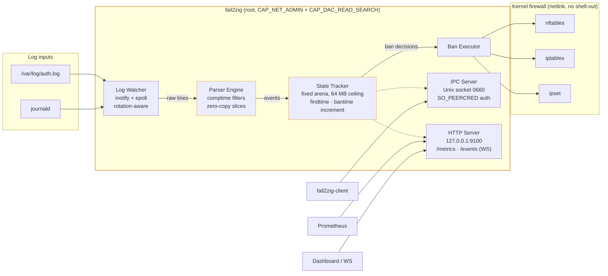

<div align="center">

# fail2zig

**A modern intrusion prevention system. Single binary. Zero runtime dependencies.**

[](https://github.com/ul0gic/fail2zig/actions/workflows/ci.yml)
[](LICENSE)
[](https://ziglang.org/download/)
[](#installation)
[](https://github.com/ul0gic/fail2zig/releases/latest)

</div>

fail2zig is a drop-in replacement for fail2ban — written in Zig, shipped as a
single static binary, with a parser that cannot be made to allocate unbounded
memory by the traffic it's supposed to be stopping.

fail2ban has served the industry for 20 years and the filter ecosystem it grew
is fail2zig's direct inheritance — we consume fail2ban `jail.conf` and
`filter.d/` unchanged. fail2zig focuses on the one thing the Python runtime
makes hard: a small, static, memory-bounded daemon that safely runs as root on
a shared host.

---

## Table of contents

- [Quick start](#quick-start)
- [Why fail2zig](#why-fail2zig)
- [Architecture](#architecture)
- [Installation](#installation)
- [Configuration](#configuration)
- [CLI usage](#cli-usage)
- [Features](#features)
- [Benchmarks](#benchmarks)
- [Comparison](#comparison)
- [Project structure](#project-structure)
- [Documentation](#documentation)
- [Contributing](#contributing)
- [License & trademark](#license)

---

## Quick start

```bash
# 1. Install (downloads the static musl binary, SHA256-verifies, installs
#    systemd unit + example config)
curl -fsSL https://github.com/ul0gic/fail2zig/raw/main/scripts/install.sh | sudo bash

# 2. (Optional) Migrate from fail2ban
sudo fail2zig --import-config /etc/fail2ban \
              --import-output /etc/fail2zig/config.toml

# 3. Validate config, then enable the service
sudo fail2zig --validate-config --config /etc/fail2zig/config.toml
sudo systemctl enable --now fail2zig

# 4. Check the daemon
fail2zig-client status
```

That's it. No package manager, no Python runtime, no regex engine to
CVE-surf around. One binary, one config file, one systemd unit.

The installer pulls from the
[latest GitHub Release](https://github.com/ul0gic/fail2zig/releases/latest)
and verifies every asset against the published `SHA256SUMS` before placing
anything on disk. Pin a specific version with
`FAIL2ZIG_VERSION=v0.1.0` or inspect the script first with
`curl -fsSL … | less`.

---

## Why fail2zig

- **Single static binary.** Copy it to any Linux host. No Python, no package
  manager, no runtime. Works on distroless containers, minimal VMs, and
  routers. Stripped release binary is ~900 KB.
- **Zero runtime dependencies.** No shell-out to `nft`, `iptables`, or any
  other CLI. fail2zig speaks netlink directly to the kernel for every
  firewall operation. See
  [architecture/zero-dependencies](https://fail2zig.com/docs/architecture/zero-dependencies/)
  for why this matters and how we verify it.
- **Hard memory ceiling.** Fixed allocators with a configurable cap (default
  64 MB). Memory does not grow under sustained brute-force or DDoS
  conditions — behavior at the ceiling is operator-defined via eviction
  policy.
- **Comptime-generated parsers.** Built-in filter patterns compile into
  specialized match functions at build time. There is no regex engine in the
  process. Attacker-controlled input never reaches a Turing-complete matcher.
- **Zero-copy hot path.** Log line → parse → state update → ban decision
  performs no heap allocation on the common case. Verified with
  `FailingAllocator` in tests.
- **Fail closed.** If the firewall backend cannot be initialised, the daemon
  exits rather than running unprotected.
- **fail2ban config import.** `--import-config /etc/fail2ban` translates
  `jail.conf` + `jail.local` + `jail.d/` + `filter.d/` into native TOML in
  one command. Migration report tells you what needed manual attention.

---

## Architecture



Deep-dive: [architecture/zero-dependencies](https://fail2zig.com/docs/architecture/zero-dependencies/).

---

## Installation

### Prebuilt binary (recommended)

```bash
curl -fsSL https://github.com/ul0gic/fail2zig/raw/main/scripts/install.sh | sudo bash
```

[`scripts/install.sh`](scripts/install.sh) detects your architecture, resolves
the latest release (or `FAIL2ZIG_VERSION` if set), downloads `fail2zig` +
`fail2zig-client` + `SHA256SUMS` from the
[release](https://github.com/ul0gic/fail2zig/releases/latest) asset tree,
verifies each binary against the signed manifest, creates the `fail2zig`
system group, installs binaries to `/usr/local/bin`, drops the example
config at `/etc/fail2zig/config.toml` (never clobbers an existing one), and
installs the hardened `fail2zig.service` unit under
`/etc/systemd/system/`. It does **not** auto-start the daemon — audit the
config, then `systemctl enable --now fail2zig` when ready.

**Supported targets (v0.1.0):**
- `x86_64-linux-musl` (879 KB stripped)
- `aarch64-linux-musl` (801 KB stripped)

`armv7-linux-musleabihf` and `mips-linux-musl` are tracked in SYS-009 and
ship in a future release.

### Dry-run / inspect the installer

```bash
# Inspect before piping to root
curl -fsSL https://github.com/ul0gic/fail2zig/raw/main/scripts/install.sh | less

# See what would happen without writing anything
curl -fsSL https://github.com/ul0gic/fail2zig/raw/main/scripts/install.sh | sudo bash -s -- --dry-run

# Install from a local checkout instead of downloading
sudo scripts/install.sh --local-bin zig-out/bin
```

### Manual install

If you'd rather skip the script:

```bash
# 1. Download the binary + manifest for your arch
VERSION=v0.1.0
ARCH=x86_64-linux-musl   # or aarch64-linux-musl
curl -fsSLO "https://github.com/ul0gic/fail2zig/releases/download/${VERSION}/fail2zig-${VERSION}-${ARCH}"
curl -fsSLO "https://github.com/ul0gic/fail2zig/releases/download/${VERSION}/fail2zig-client-${VERSION}-${ARCH}"
curl -fsSLO "https://github.com/ul0gic/fail2zig/releases/download/${VERSION}/SHA256SUMS"

# 2. Verify (bail if any line fails)
sha256sum --check --ignore-missing SHA256SUMS

# 3. Install
sudo install -m 0755 "fail2zig-${VERSION}-${ARCH}"        /usr/local/bin/fail2zig
sudo install -m 0755 "fail2zig-client-${VERSION}-${ARCH}" /usr/local/bin/fail2zig-client
sudo groupadd --system fail2zig 2>/dev/null || true
```

Then follow the [systemd setup](#systemd-setup) block below.

### Build from source

Requires [Zig 0.14.1](https://ziglang.org/download/).

```bash
git clone https://github.com/ul0gic/fail2zig
cd fail2zig

# Production build (safety checks retained on parser + network paths)
zig build -Doptimize=.ReleaseSafe

# Binaries land in zig-out/bin/
ls zig-out/bin/
# fail2zig
# fail2zig-client
```

### Cross-compile

Supported shipped targets (see [.github/workflows/release.yml](.github/workflows/release.yml)):

```bash
zig build -Dtarget=x86_64-linux-musl  -Doptimize=.ReleaseSafe
zig build -Dtarget=aarch64-linux-musl -Doptimize=.ReleaseSafe
```

Both produce statically linked musl binaries with no runtime dependencies.
`armv7-linux-musleabihf` and `mips-linux-musl` are architected and partially
implemented but gated on a portability fix (atomic counter mutex + `socklen_t`
cast) tracked for a future release.

### systemd setup

If you used `scripts/install.sh`, the unit file is already in place — skip to
[Configuration](#configuration).

From a repo checkout:

```bash
sudo install -m 0644 deploy/fail2zig.service /etc/systemd/system/
sudo install -m 0644 deploy/fail2zig.socket  /etc/systemd/system/
sudo install -d -m 0750 /etc/fail2zig
sudo install -m 0644 deploy/fail2zig.toml.example /etc/fail2zig/config.toml
sudo systemctl daemon-reload
sudo systemctl enable --now fail2zig
```

From a downloaded release (the same three files are published alongside
the binaries):

```bash
VERSION=v0.1.0
for f in fail2zig.service fail2zig.socket fail2zig.toml.example; do
  curl -fsSLO "https://github.com/ul0gic/fail2zig/releases/download/${VERSION}/${f}"
done
sudo install -m 0644 fail2zig.service /etc/systemd/system/
sudo install -m 0644 fail2zig.socket  /etc/systemd/system/
sudo install -d -m 0750 /etc/fail2zig
sudo install -m 0644 fail2zig.toml.example /etc/fail2zig/config.toml
sudo systemctl daemon-reload
sudo systemctl enable --now fail2zig
```

The shipped unit is hardened: `ProtectSystem=strict`, `NoNewPrivileges=yes`,
`CapabilityBoundingSet=CAP_NET_ADMIN CAP_DAC_READ_SEARCH`,
`RuntimeDirectory=fail2zig` (auto-created on every start), no home
directories, no device nodes, no kernel tunables. `systemd-analyze security
fail2zig` scores 2.4 (OK).

---

## Configuration

`fail2zig` reads one TOML file — `/etc/fail2zig/config.toml` by default.
The installer and the systemd setup both drop a fully-commented example
there. Edit it, validate, restart.

A minimal working config:

```toml
[global]
socket_path        = "/run/fail2zig/fail2zig.sock"
state_file         = "/var/lib/fail2zig/state.bin"
memory_ceiling_mb  = 64
metrics_bind       = "127.0.0.1"
metrics_port       = 9100

[defaults]
bantime    = 600      # seconds
findtime   = 600      # sliding window for counting attempts
maxretry   = 5        # attempts inside findtime before a ban
banaction  = "nftables"
ignoreip   = ["127.0.0.1/8", "::1"]

# bantime_increment controls how repeat offenders get longer bans.
bantime_increment_enabled     = true
bantime_increment_formula     = "exponential"
bantime_increment_multiplier  = 2
bantime_increment_max_bantime = 604800   # cap at 7 days

[jails.sshd]
enabled = true
filter  = "sshd"
logpath = ["/var/log/auth.log", "/var/log/secure"]

[jails.nginx-botsearch]
enabled = true
filter  = "nginx-botsearch"
logpath = ["/var/log/nginx/access.log"]
```

After editing:

```bash
sudo fail2zig --validate-config --config /etc/fail2zig/config.toml
sudo systemctl restart fail2zig
fail2zig-client status
```

### Threshold knobs in v0.1.0

In **v0.1.0**, the `bantime`, `findtime`, `maxretry`, and
`bantime_increment_*` values are honored from `[defaults]` only — a single
shared state tracker applies the same thresholds across every jail. Per-jail
overrides (`[jails.<name>].maxretry = …` etc.) are parsed and accepted by
the validator, but have no runtime effect. Per-jail threshold tracking is
the first item in the v0.2 scope (tracked as ISSUE-007). Set the values
you want globally in `[defaults]` until then; per-jail `enabled`,
`filter`, and `logpath` work as expected.

Full schema and every option: [reference/config](https://fail2zig.com/docs/reference/config/).

### Migrate from fail2ban

```bash
fail2zig --import-config /etc/fail2ban \
         --import-output /etc/fail2zig/config.toml
```

The importer merges `jail.conf` → `jail.local` → `jail.d/*`, translates
Python regex patterns to the fail2zig DSL where possible, maps action names
to native backends, and prints a migration report.

Step-by-step guide: [guides/migration-from-fail2ban](https://fail2zig.com/docs/guides/migration-from-fail2ban/).

---

## CLI usage

### Daemon — `fail2zig(1)`

```
fail2zig [OPTIONS]

OPTIONS:
  --config <path>           Config file (default: /etc/fail2zig/config.toml)
  --foreground              Run in foreground (v0.1: only mode)
  --validate-config         Load and validate config, exit
  --import-config [<dir>]   Import fail2ban config (default: /etc/fail2ban)
  --import-output <path>    Output path for imported config
  --version, -V             Print version and exit
  --help, -h                Print help and exit
```

Full reference: [reference/cli-fail2zig](https://fail2zig.com/docs/reference/cli-fail2zig/) ·
man page: [docs/man/fail2zig.1](docs/man/fail2zig.1).

### Client — `fail2zig-client(1)`

| Command | Description |
|---------|-------------|
| `status` | Daemon uptime, active bans, parse rate, memory usage |
| `ban <ip> --jail <name>` | Add a ban (`--duration <seconds>` optional) |
| `unban <ip> [--jail <name>]` | Remove a ban |
| `list [--jail <name>]` | List active bans |
| `jails` | List configured jails |
| `reload` | Signal the daemon to reload config |
| `version` | Print daemon version |
| `completions <bash\|zsh\|fish>` | Print shell completion script |

Global flags: `--socket <path>`, `--output table|json|plain`, `--no-color`,
`--timeout <ms>`.

Full reference: [reference/cli-fail2zig-client](https://fail2zig.com/docs/reference/cli-fail2zig-client/) ·
man page: [docs/man/fail2zig-client.1](docs/man/fail2zig-client.1).

---

## Features

### Parser engine

Comptime DSL compiles pattern definitions into specialized `MatchFn` functions
at build time. `<IP>`, `<HOST>`, `<TIMESTAMP>`, and `<*>` tokens produce
zero-alloc parse paths. A multi-pattern `Matcher` adds min-length and
first-byte early-exit probes. The entire hot path is verified zero-alloc via
`FailingAllocator`.

### Firewall backends

Backend-agnostic dispatch; best available is detected at startup:

| Backend | Implementation | Notes |
|---------|----------------|-------|
| nftables | netlink, no shell-out (`engine/firewall/nftables.zig`) | Preferred on modern kernels |
| iptables | argv subprocess (`engine/firewall/iptables.zig`) | Legacy fallback |
| ipset | argv subprocess (`engine/firewall/ipset.zig`) | High-cardinality ban lists |

eBPF/XDP (NIC-level drop) is architected; ships in a future release.

### Ban lifecycle

- Per-IP 128-slot ring buffer of attempt timestamps for sliding `findtime` windows
- Linear and exponential `bantime_increment`, capped at `bantime_increment_max_bantime`
- CIDR-based ignore list (IPv4 `/0`–`/32`, IPv6 `/0`–`/128`); ignored IPs
  short-circuit before any state update
- Three eviction policies when the state table is full: `evict_oldest`,
  `ban_all_and_alert`, `drop_oldest_unbanned`
- Atomic state persistence (write-to-temp + fsync + rename); CRC32-validated
  on load; restored bans are reconciled into the firewall on restart

### IPC & metrics

- Unix domain socket at `/run/fail2zig/fail2zig.sock` — mode 0660,
  `SO_PEERCRED` authentication, length-prefixed binary protocol, 8 concurrent
  clients, 1 MiB frame cap
- HTTP on `127.0.0.1:9100` — `GET /metrics` (Prometheus), `GET /api/status`
  (JSON), `GET /events` (WebSocket, RFC 6455; broadcasts `attack_detected`,
  `ip_banned`, `ip_unbanned`, `metrics`; max 16 clients)

### Built-in filters (15)

| Category | Filters |
|----------|---------|
| SSH | `sshd` (9 patterns: OpenSSH 7.x / 8.x / 9.x auth failures, invalid user, PAM, disconnect, bad protocol, reverse mapping) |
| Web | `nginx-http-auth`, `nginx-limit-req`, `nginx-botsearch`, `apache-auth`, `apache-badbots`, `apache-overflows` |
| Mail | `postfix`, `dovecot`, `courier` |
| DNS | `named-refused` (BIND) |
| FTP | `vsftpd`, `proftpd` |
| Database | `mysqld-auth` |
| Meta | `recidive` (escalates repeat offenders) |

Full reference: [reference/filters](https://fail2zig.com/docs/reference/filters/).
Filter names accept hyphenated or underscore forms
(`nginx-http-auth` ≡ `nginx_http_auth`).

---

## Benchmarks

Measured on the reference lab box (x86_64, ReleaseSafe, stripped).
Reproducible via `make bench` and the `tests/harness/measure.sh` probes.

| Metric | Target | Measured |
|--------|--------|----------|
| Parse throughput (lines/sec) | ≥ 22,000 | **~5.96M** |
| Ban decision latency (p99) | < 1 ms | **932 ns** (p50: 365 ns) |
| Memory under attack (50K unique IPs) | ≤ ceiling, never exceed | 21,845 entries resident, 15,606 evictions — cap held |
| Binary size (x86_64-linux-musl, stripped) | ≤ 5 MB | **877 KB** |
| Cold start → ready for events | < 100 ms | Lab-dependent (skips unprivileged hosts) |

Benchmark harness and methodology:
[tests/benchmark/README.md](tests/benchmark/README.md). Real-system validation
harness: [tests/harness/README.md](tests/harness/README.md).

---

## Comparison

| | fail2ban | SSHGuard | CrowdSec | fail2zig |
|---|---|---|---|---|
| Language | Python | C | Go | Zig |
| Deployment | Package + runtime | Single binary | Binary + cloud | Single static binary |
| Runtime deps | Python 3 + libs | libc | Go runtime | None |
| Config format | INI (jail.conf) | Custom | YAML | TOML (native) + fail2ban compat |
| Migration path | — | Manual | Manual | `--import-config /etc/fail2ban` |
| Memory ceiling | No (GC) | N/A | No | Hard configurable cap |
| Static binary | No | Partial | No | Yes (musl-linked) |
| Firewall calls | Shell-out | Shell-out | Shell-out | Direct netlink |
| Banning mechanism | iptables / nftables | pf / iptables / nftables | iptables / nftables + cloud API | nftables / iptables / ipset |

fail2zig is pre-1.0. The table reflects shipped capability, not roadmap.
fail2ban is the lineage fail2zig inherits from — filter regexes and
`jail.conf` continue to work unchanged through the compatibility layer.

---

## Project structure

```
fail2zig/
├── engine/              # Daemon (runs as root)
│   ├── core/            # Event loop, log watcher, parser, state tracker
│   ├── firewall/        # nftables (netlink), iptables, ipset backends
│   ├── config/          # Native TOML + fail2ban jail.conf importer
│   ├── filters/         # Comptime-generated filter library (15 filters)
│   ├── net/             # HTTP metrics + WebSocket event server
│   └── main.zig         # Entry point, CLI args, daemon lifecycle
├── client/              # fail2zig-client (unprivileged CLI)
├── shared/              # Common types (IPC protocol, IP addresses)
├── tests/               # See tests/README.md for the layout
│   ├── integration/     # Zig integration tests
│   ├── benchmark/       # Zig microbenchmarks (-Dbench=true)
│   ├── fuzz/            # Zig fuzz corpora (parsers, protocol, config)
│   └── harness/         # Shell-based system harness (lab-box tests)
├── docs/                # Installable man pages
│   └── man/             # troff: fail2zig(1), fail2zig-client(1), fail2zig.toml(5)
├── deploy/              # systemd unit, socket, example config
├── scripts/             # Public installer (scripts/install.sh)
├── .github/workflows/   # CI (ci.yml) + release pipeline (release.yml)
├── build.zig            # Builds engine + client
└── build.zig.zon        # Zig package manifest
```

---

## Documentation

| Kind | Where | What |
|------|-------|------|
| Architecture | [fail2zig.com/docs](https://fail2zig.com/docs/) | Why decisions were made (zero-dependencies deep-dive) |
| Guides | [fail2zig.com/docs](https://fail2zig.com/docs/) | Task-oriented walkthroughs (migration from fail2ban) |
| Reference | [fail2zig.com/docs](https://fail2zig.com/docs/) | Config schema, CLI flags, filter catalogue |
| Man pages | [docs/man/](docs/man/) | `fail2zig(1)`, `fail2zig-client(1)`, `fail2zig.toml(5)` |
| Tests | [tests/README.md](tests/README.md) | Unit / integration / benchmark / fuzz / harness layout |

---

## Contributing

fail2zig wants to be the modern replacement for fail2ban — the drop-in
tool that understands the services people actually run in 2026.
Contributors are how it gets there. The codebase is small (~18K lines of
Zig), the conventions are boring on purpose, and the contribution surface
is wide open.

### The biggest ask: modern filters

fail2ban's built-in filter library largely stopped expanding around 2015.
The internet moved on. The highest-leverage contribution right now is
**a pattern file for a service you actually run**. Candidates we'd love
to ship:

- **Container + orchestration** — Docker daemon events, Kubernetes API auth, Nomad, container runtime audit logs
- **Reverse proxies** — Traefik, Caddy, Envoy, HAProxy
- **Self-hosted services** — Vaultwarden, Authelia, Keycloak, Gitea, Forgejo, Jellyfin, Immich, Nextcloud, Jenkins
- **LLM endpoints** — Ollama, OpenWebUI, LocalAI — a whole category that post-dates fail2ban
- **Databases** — PostgreSQL, Redis, MongoDB auth failures
- **Observability** — Grafana, Prometheus unauthorized access

Each filter is a handful of log-line patterns plus a few test cases.
`engine/filters/sshd.zig` is the cleanest reference for the shape. Bring
real log lines from a real deployment if you can — that's the gold
standard.

Not a Zig developer? Good filter proposals are welcome as issues too — a
few representative log lines + the name of the service is enough to open
the door.

### Good first contributions

- **Add a filter** for any service listed above (or one that isn't).
- **Improve fail2ban migration output** — if `--import-config` skipped or mistranslated a jail you use, open an issue with the original `jail.conf` stanza.
- **Fix a doc rough edge** — typos, unclear wording, missing context in a `.md` file.
- **Add a test case** to an existing filter that covers an edge case.
- **Benchmark fail2zig on a platform** we don't test and share numbers.
- **Bug report from real deployment** — what broke, what you'd expect.

### Pick your path

| You want to... | Path |
|---|---|
| **Report a security vulnerability** | [GitHub Private Security Advisories](https://github.com/ul0gic/fail2zig/security/advisories/new) — not a public issue. Ack in 48 h, coordinated disclosure. See [SECURITY.md](SECURITY.md). |
| **Report a bug** | [Open an issue](https://github.com/ul0gic/fail2zig/issues/new). Include Zig version (`zig version`), OS (`uname -a`), and a minimal config that reproduces it. |
| **Add a filter for a modern service** | PR directly. Include positive + negative test cases and real log lines if you have them. |
| **Fix a typo, doc, or small bug** | PR directly. No issue needed. |
| **Propose a feature** | Open an issue to sketch the shape — saves you building something that won't fit. |
| **Contribute a larger change** | Issue first so we can align, then PR. Keep PRs single-purpose. |

### Licensing

By opening a pull request, you agree your contribution is licensed
**AGPL-3.0-or-later** — the same license as the rest of the project. No
CLA, no sign-off ceremony. `git blame` is the authorship record.

Trademark on the "fail2zig" name and logo is separate and not granted by
contributing — see [Trademark](#trademark) below.

### Development setup

```bash
# Engine + client
git clone https://github.com/ul0gic/fail2zig
cd fail2zig
zig build test          # ~2s · green, zero leaks

# Web (marketing site + demo dashboard)
cd web
pnpm install
pnpm dev                # local preview on :4321
```

**Requires:**
- [Zig 0.14.1](https://ziglang.org/download/) exactly. Newer versions may break the build.
- For web work: Node via [nvm](https://github.com/nvm-sh/nvm) (never apt / NodeSource), pnpm 9+.

### Standards

CI enforces these — not because we're precious, because they catch real
bugs early and keep the binary small.

**Zig:**
- `zig fmt engine/ client/ shared/ tests/` before every commit — CI-enforced
- `zig build` and `zig build test` pass, zero failures, zero leaks
- Zero compiler warnings; `zig build -Doptimize=.ReleaseSafe` clean
- No `@panic` in production code — propagate errors explicitly
- No `@setRuntimeSafety(false)` without a comment proving the safety invariant
- All tests use `std.testing.allocator` for leak detection
- SPDX header on every `.zig` file (CI-enforced)

**Web (`web/`):**
- `pnpm format:check`, `pnpm lint`, `pnpm typecheck` all green
- No added runtime framework dependencies — Astro + HTML + CSS is the stack
- Theme tokens via `src/styles/theme.css`, no inline styles in production

### A good PR

- **One purpose per PR.** A bug fix is not a refactor + rename + unrelated cleanup. If the description wants to say "also," split it.
- **Commit messages follow existing style:** `feat(scope): …`, `fix(scope): …`, `docs(scope): …`, `chore(scope): …`. Scope is the directory or module.
- **Description explains *why*.** The diff already shows *what*. If it fixes a bug, link the issue.
- **Tests.** A bug fix includes a regression test that would have failed before the fix. A feature covers the happy path plus at least one error case. Filter contributions include positive + negative log lines.
- **CI green.** If CI is broken on `main`, that's its own PR first.

A PR that hits those marks gets reviewed. Feedback is aimed at landing
the change, not gatekeeping — if something needs adjusting, we'll say
what and why.

### Things we're intentionally not building

Open an issue if you want to argue for any of these — the list is not
immutable, just what we've decided against so far:

- **Windows or macOS support** — Linux-only until v1.0.
- **GUI dashboards inside the daemon** — the `/events` WebSocket is the extension point. Dashboards live outside the daemon.
- **Plugin systems or embedded scripting in the core** — see [architecture/zero-dependencies](https://fail2zig.com/docs/architecture/zero-dependencies/) for the reasoning.
- **SIEM-specific adapters** — fail2zig emits Prometheus metrics + structured JSON; SIEM vendors handle ingestion on their side.
- **Shell-out ban actions** — fail2ban's CVE history speaks for itself. Firewall access is via direct netlink in fail2zig, not subprocess chains.

### Useful Makefile targets

```bash
make build          # Debug build
make test           # zig build test
make bench          # Microbenchmarks
make fuzz           # Fuzz corpus run
make release        # ReleaseSafe native build
make cross          # ReleaseSafe x86_64 + aarch64 musl
make lint           # zig fmt --check, shellcheck, yamllint
make harness-smoke  # Lab-box attack smoke test (requires a Linux host)
```

Run a single test or filter by substring:

```bash
zig build test -Dtest-filter=parser
```

### Review + communication

Everything lives on the repo — issues, PRs, and security advisories.
Keeping it there means the project history is public and searchable; new
contributors can read what was decided and why without joining a chat.

Review timing is best-effort. Small PRs usually get a first look within a
few days; larger ones longer. Security advisories are acknowledged within
48 hours. A gentle ping on a PR untouched for two weeks is welcome.

---

## License

fail2zig is licensed under the **GNU Affero General Public License v3.0 or
later** (AGPL-3.0-or-later). See [LICENSE](LICENSE) for the full text.

In plain terms:

- You can run, read, fork, modify, and redistribute fail2zig.
- If you modify it, your modifications are also AGPL-3.0-or-later and must be
  published on request — including when you only expose the software over a
  network (the "network use is distribution" clause is the whole point of
  AGPL).
- Internal commercial use is fine. Self-hosting is fine. Forking for your
  own needs is fine. Publishing a fork under a different name is fine.

The AGPL covers **code rights**. Brand, name, and identity are separate — see
Trademark below.

## Trademark

"fail2zig", the fail2zig wordmark, and the fail2zig logo are trademarks of
the project maintainer. Trademark rights are asserted immediately (™) and
registration is planned.

You may fork and modify the code under the AGPL-3.0-or-later. You may **not**:

- use the "fail2zig" name, wordmark, or logo for a derived, modified, or
  repackaged distribution;
- imply your fork is the official project, endorsed by the maintainer, or
  affiliated with fail2zig;
- use the name or branding for a commercial hosted service offering.

If you ship a fork, give it a different name. This separation — permissive
code rights, strict name rights — is the same model used by Redis
(pre-2024), Elasticsearch, and Grafana Labs. Contact the maintainer for any
trademark licensing question.
