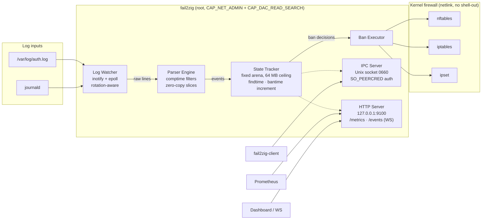

<div align="center">

# fail2zig

**A modern intrusion prevention system. Single binary. Zero runtime dependencies.**

[](https://github.com/ul0gic/fail2zig/actions/workflows/ci.yml)
[](LICENSE)
[](https://ziglang.org/download/)
[](#installation)
[](#project-status)

</div>

fail2zig is a drop-in replacement for fail2ban — written in Zig, shipped as a
single static binary, with a parser that cannot be made to allocate unbounded
memory by the traffic it's supposed to be stopping.

fail2ban has served the industry for 20 years and the filter ecosystem it grew
is fail2zig's direct inheritance — we consume fail2ban `jail.conf` and
`filter.d/` unchanged. fail2zig focuses on the one thing the Python runtime
makes hard: a small, static, memory-bounded daemon that safely runs as root on
a shared host.

---

## Table of contents

- [Quick start](#quick-start)
- [Why fail2zig](#why-fail2zig)
- [Architecture](#architecture)
- [Installation](#installation)
- [Configuration](#configuration)
- [CLI usage](#cli-usage)
- [Features](#features)
- [Benchmarks](#benchmarks)
- [Comparison](#comparison)
- [Project structure](#project-structure)
- [Documentation](#documentation)
- [Project status](#project-status)
- [Contributing](#contributing)
- [License & trademark](#license)

---

## Quick start

```bash
# 1. Build (ReleaseSafe keeps bounds checking on the attacker-facing path)
zig build -Doptimize=.ReleaseSafe

# 2. Import your existing fail2ban config (optional)
./zig-out/bin/fail2zig --import-config /etc/fail2ban \
                      --import-output /etc/fail2zig/config.toml

# 3. Validate, then run
./zig-out/bin/fail2zig --validate-config --config /etc/fail2zig/config.toml
sudo ./zig-out/bin/fail2zig --foreground --config /etc/fail2zig/config.toml
```

Prebuilt static musl binaries will be published on the
[GitHub Releases](https://github.com/ul0gic/fail2zig/releases) page once v0.1.0
is tagged.

---

## Why fail2zig

- **Single static binary.** Copy it to any Linux host. No Python, no package
  manager, no runtime. Works on distroless containers, minimal VMs, and
  routers. Stripped release binary is ~900 KB.
- **Zero runtime dependencies.** No shell-out to `nft`, `iptables`, or any
  other CLI. fail2zig speaks netlink directly to the kernel for every
  firewall operation. See
  [architecture/zero-dependencies](https://fail2zig.com/docs/architecture/zero-dependencies/)
  for why this matters and how we verify it.
- **Hard memory ceiling.** Fixed allocators with a configurable cap (default
  64 MB). Memory does not grow under sustained brute-force or DDoS
  conditions — behavior at the ceiling is operator-defined via eviction
  policy.
- **Comptime-generated parsers.** Built-in filter patterns compile into
  specialized match functions at build time. There is no regex engine in the
  process. Attacker-controlled input never reaches a Turing-complete matcher.
- **Zero-copy hot path.** Log line → parse → state update → ban decision
  performs no heap allocation on the common case. Verified with
  `FailingAllocator` in tests.
- **Fail closed.** If the firewall backend cannot be initialised, the daemon
  exits rather than running unprotected.
- **fail2ban config import.** `--import-config /etc/fail2ban` translates
  `jail.conf` + `jail.local` + `jail.d/` + `filter.d/` into native TOML in
  one command. Migration report tells you what needed manual attention.

---

## Architecture



Deep-dive: [architecture/zero-dependencies](https://fail2zig.com/docs/architecture/zero-dependencies/).

---

## Installation

### Prebuilt binary (post-v0.1.0)

Static musl binaries and a `SHA256SUMS` manifest will be published on the
[Releases](https://github.com/ul0gic/fail2zig/releases) page. `scripts/install.sh`
fetches the latest release, verifies checksums, installs the binaries and the
systemd unit, and creates the `fail2zig` system group.

### Build from source

Requires [Zig 0.14.1](https://ziglang.org/download/).

```bash
git clone https://github.com/ul0gic/fail2zig
cd fail2zig

# Production build (safety checks retained on parser + network paths)
zig build -Doptimize=.ReleaseSafe

# Binaries land in zig-out/bin/
ls zig-out/bin/
# fail2zig
# fail2zig-client
```

### Cross-compile

Supported shipped targets (see [.github/workflows/release.yml](.github/workflows/release.yml)):

```bash
zig build -Dtarget=x86_64-linux-musl  -Doptimize=.ReleaseSafe
zig build -Dtarget=aarch64-linux-musl -Doptimize=.ReleaseSafe
```

Both produce statically linked musl binaries with no runtime dependencies.
`armv7-linux-musleabihf` and `mips-linux-musl` are architected and partially
implemented but gated on a portability fix (atomic counter mutex + `socklen_t`
cast) tracked for a future release.

### systemd setup

```bash
sudo install -m 0644 deploy/fail2zig.service /etc/systemd/system/
sudo install -m 0644 deploy/fail2zig.socket  /etc/systemd/system/
sudo install -m 0644 deploy/fail2zig.toml.example /etc/fail2zig/config.toml
sudo systemctl daemon-reload
sudo systemctl enable --now fail2zig
```

The shipped unit is hardened: `ProtectSystem=strict`, `NoNewPrivileges=yes`,
`CapabilityBoundingSet=CAP_NET_ADMIN CAP_DAC_READ_SEARCH`, no home
directories, no device nodes, no kernel tunables. `systemd-analyze security
fail2zig` scores 2.4 (OK).

---

## Configuration

Copy `deploy/fail2zig.toml.example` to `/etc/fail2zig/config.toml` and edit.
Minimal config:

```toml
[global]
socket_path        = "/run/fail2zig/fail2zig.sock"
state_file         = "/var/lib/fail2zig/state.bin"
memory_ceiling_mb  = 64
metrics_bind       = "127.0.0.1"
metrics_port       = 9100

[defaults]
bantime    = 600      # seconds
findtime   = 600      # sliding window
maxretry   = 5
banaction  = "nftables"
ignoreip   = ["127.0.0.1/8", "::1"]

[jails.sshd]
enabled  = true
filter   = "sshd"
logpath  = ["/var/log/auth.log", "/var/log/secure"]
maxretry = 3
bantime  = 3600
bantime_increment_enabled     = true
bantime_increment_formula     = "exponential"
bantime_increment_multiplier  = 2
bantime_increment_max_bantime = 604800
```

Full schema and every option: [reference/config](https://fail2zig.com/docs/reference/config/).

### Migrate from fail2ban

```bash
fail2zig --import-config /etc/fail2ban \
         --import-output /etc/fail2zig/config.toml
```

The importer merges `jail.conf` → `jail.local` → `jail.d/*`, translates
Python regex patterns to the fail2zig DSL where possible, maps action names
to native backends, and prints a migration report.

Step-by-step guide: [guides/migration-from-fail2ban](https://fail2zig.com/docs/guides/migration-from-fail2ban/).

---

## CLI usage

### Daemon — `fail2zig(1)`

```
fail2zig [OPTIONS]

OPTIONS:
  --config <path>           Config file (default: /etc/fail2zig/config.toml)
  --foreground              Run in foreground (v0.1: only mode)
  --validate-config         Load and validate config, exit
  --import-config [<dir>]   Import fail2ban config (default: /etc/fail2ban)
  --import-output <path>    Output path for imported config
  --version, -V             Print version and exit
  --help, -h                Print help and exit
```

Full reference: [reference/cli-fail2zig](https://fail2zig.com/docs/reference/cli-fail2zig/) ·
man page: [docs/man/fail2zig.1](docs/man/fail2zig.1).

### Client — `fail2zig-client(1)`

| Command | Description |
|---------|-------------|
| `status` | Daemon uptime, active bans, parse rate, memory usage |
| `ban <ip> --jail <name>` | Add a ban (`--duration <seconds>` optional) |
| `unban <ip> [--jail <name>]` | Remove a ban |
| `list [--jail <name>]` | List active bans |
| `jails` | List configured jails |
| `reload` | Signal the daemon to reload config |
| `version` | Print daemon version |
| `completions <bash\|zsh\|fish>` | Print shell completion script |

Global flags: `--socket <path>`, `--output table|json|plain`, `--no-color`,
`--timeout <ms>`.

Full reference: [reference/cli-fail2zig-client](https://fail2zig.com/docs/reference/cli-fail2zig-client/) ·
man page: [docs/man/fail2zig-client.1](docs/man/fail2zig-client.1).

---

## Features

### Parser engine

Comptime DSL compiles pattern definitions into specialized `MatchFn` functions
at build time. `<IP>`, `<HOST>`, `<TIMESTAMP>`, and `<*>` tokens produce
zero-alloc parse paths. A multi-pattern `Matcher` adds min-length and
first-byte early-exit probes. The entire hot path is verified zero-alloc via
`FailingAllocator`.

### Firewall backends

Backend-agnostic dispatch; best available is detected at startup:

| Backend | Implementation | Notes |
|---------|----------------|-------|
| nftables | netlink, no shell-out (`engine/firewall/nftables.zig`) | Preferred on modern kernels |
| iptables | argv subprocess (`engine/firewall/iptables.zig`) | Legacy fallback |
| ipset | argv subprocess (`engine/firewall/ipset.zig`) | High-cardinality ban lists |

eBPF/XDP (NIC-level drop) is architected; ships in a future release.

### Ban lifecycle

- Per-IP 128-slot ring buffer of attempt timestamps for sliding `findtime` windows
- Linear and exponential `bantime_increment`, capped at `bantime_increment_max_bantime`
- CIDR-based ignore list (IPv4 `/0`–`/32`, IPv6 `/0`–`/128`); ignored IPs
  short-circuit before any state update
- Three eviction policies when the state table is full: `evict_oldest`,
  `ban_all_and_alert`, `drop_oldest_unbanned`
- Atomic state persistence (write-to-temp + fsync + rename); CRC32-validated
  on load; restored bans are reconciled into the firewall on restart

### IPC & metrics

- Unix domain socket at `/run/fail2zig/fail2zig.sock` — mode 0660,
  `SO_PEERCRED` authentication, length-prefixed binary protocol, 8 concurrent
  clients, 1 MiB frame cap
- HTTP on `127.0.0.1:9100` — `GET /metrics` (Prometheus), `GET /api/status`
  (JSON), `GET /events` (WebSocket, RFC 6455; broadcasts `attack_detected`,
  `ip_banned`, `ip_unbanned`, `metrics`; max 16 clients)

### Built-in filters (15)

| Category | Filters |
|----------|---------|
| SSH | `sshd` (9 patterns: OpenSSH 7.x / 8.x / 9.x auth failures, invalid user, PAM, disconnect, bad protocol, reverse mapping) |
| Web | `nginx-http-auth`, `nginx-limit-req`, `nginx-botsearch`, `apache-auth`, `apache-badbots`, `apache-overflows` |
| Mail | `postfix`, `dovecot`, `courier` |
| DNS | `named-refused` (BIND) |
| FTP | `vsftpd`, `proftpd` |
| Database | `mysqld-auth` |
| Meta | `recidive` (escalates repeat offenders) |

Full reference: [reference/filters](https://fail2zig.com/docs/reference/filters/).
Filter names accept hyphenated or underscore forms
(`nginx-http-auth` ≡ `nginx_http_auth`).

---

## Benchmarks

Measured on the Phase 7.5 lab box (x86_64, ReleaseSafe, stripped). Reproducible
via `make bench` and the `tests/harness/measure.sh` probes.

| Metric | Target | Measured |
|--------|--------|----------|
| Parse throughput (lines/sec) | ≥ 22,000 | **~5.96M** |
| Ban decision latency (p99) | < 1 ms | **932 ns** (p50: 365 ns) |
| Memory under attack (50K unique IPs) | ≤ ceiling, never exceed | 21,845 entries resident, 15,606 evictions — cap held |
| Binary size (x86_64-linux-musl, stripped) | ≤ 5 MB | **877 KB** |
| Cold start → ready for events | < 100 ms | Lab-dependent (skips unprivileged hosts) |

Benchmark harness and methodology:
[tests/benchmark/README.md](tests/benchmark/README.md). Real-system validation
harness: [tests/harness/README.md](tests/harness/README.md).

---

## Comparison

| | fail2ban | SSHGuard | CrowdSec | fail2zig |
|---|---|---|---|---|
| Language | Python | C | Go | Zig |
| Deployment | Package + runtime | Single binary | Binary + cloud | Single static binary |
| Runtime deps | Python 3 + libs | libc | Go runtime | None |
| Config format | INI (jail.conf) | Custom | YAML | TOML (native) + fail2ban compat |
| Migration path | — | Manual | Manual | `--import-config /etc/fail2ban` |
| Memory ceiling | No (GC) | N/A | No | Hard configurable cap |
| Static binary | No | Partial | No | Yes (musl-linked) |
| Firewall calls | Shell-out | Shell-out | Shell-out | Direct netlink |
| Banning mechanism | iptables / nftables | pf / iptables / nftables | iptables / nftables + cloud API | nftables / iptables / ipset |

fail2zig is pre-1.0. The table reflects shipped capability, not roadmap.
fail2ban is the lineage fail2zig inherits from — filter regexes and
`jail.conf` continue to work unchanged through the compatibility layer.

---

## Project structure

```
fail2zig/
├── engine/              # Daemon (runs as root)
│   ├── core/            # Event loop, log watcher, parser, state tracker
│   ├── firewall/        # nftables (netlink), iptables, ipset backends
│   ├── config/          # Native TOML + fail2ban jail.conf importer
│   ├── filters/         # Comptime-generated filter library (15 filters)
│   ├── net/             # HTTP metrics + WebSocket event server
│   └── main.zig         # Entry point, CLI args, daemon lifecycle
├── client/              # fail2zig-client (unprivileged CLI)
├── shared/              # Common types (IPC protocol, IP addresses)
├── tests/               # See tests/README.md for the layout
│   ├── integration/     # Zig integration tests
│   ├── benchmark/       # Zig microbenchmarks (-Dbench=true)
│   ├── fuzz/            # Zig fuzz corpora (parsers, protocol, config)
│   └── harness/         # Shell-based system harness (lab-box tests)
├── docs/                # Installable man pages
│   └── man/             # troff: fail2zig(1), fail2zig-client(1), fail2zig.toml(5)
├── deploy/              # systemd unit, socket, example config
├── scripts/             # Public installer (scripts/install.sh)
├── .github/workflows/   # CI (ci.yml) + release pipeline (release.yml)
├── build.zig            # Builds engine + client
└── build.zig.zon        # Zig package manifest
```

---

## Documentation

| Kind | Where | What |
|------|-------|------|
| Architecture | [fail2zig.com/docs](https://fail2zig.com/docs/) | Why decisions were made (zero-dependencies deep-dive) |
| Guides | [fail2zig.com/docs](https://fail2zig.com/docs/) | Task-oriented walkthroughs (migration from fail2ban) |
| Reference | [fail2zig.com/docs](https://fail2zig.com/docs/) | Config schema, CLI flags, filter catalogue |
| Man pages | [docs/man/](docs/man/) | `fail2zig(1)`, `fail2zig-client(1)`, `fail2zig.toml(5)` |
| Tests | [tests/README.md](tests/README.md) | Unit / integration / benchmark / fuzz / harness layout |

---

## Project status

Pre-release. v0.1.0 candidate.

| Phase | Status |
|-------|--------|
| 1. Foundation | ✅ Complete |
| 2. Core engine (event loop, log watcher) | ✅ Complete |
| 3. Parser + config + firewall backends | ✅ Complete |
| 4. Ban lifecycle + persistence | ✅ Complete |
| 5. IPC + client + metrics + WebSocket | ✅ Complete |
| 6. fail2ban compat + filter library | ✅ Complete |
| 7. Hardening + testing | ✅ Complete |
| 7.5. Real-system validation (netns, bare-metal) | 🔄 90% — 12h soak remaining |
| 8. Docs + DevOps (CI, release, systemd) | ✅ Complete |
| 9. Attack simulator + marketing site | ⬜ Not started |
| 10. Final polish (v0.1.0 tag) | ⬜ Not started |

**Test suite:** 588 passing, 7 skipped (unprivileged-host gates), 0 failed,
0 leaks reported by `std.testing.allocator`.

fail2zig has not been through an external security audit. Run it in
environments where that limitation is acceptable.

---

## Contributing

Standards:

- `zig fmt engine/ client/ shared/ tests/` is law — run before every commit
  (enforced by CI)
- `zig build` and `zig build test` must pass with zero failures and zero
  leaks
- Zero compiler warnings; `zig build -Doptimize=.ReleaseSafe` must be clean
- No `@panic` in production code — propagate errors explicitly
- No `@setRuntimeSafety(false)` without a comment proving the safety
  invariant
- All tests use `std.testing.allocator` for leak detection

Useful targets in the [`Makefile`](Makefile):

```bash
make build          # Debug build
make test           # zig build test
make bench          # microbenchmarks
make fuzz           # fuzz corpus run
make release        # ReleaseSafe native
make cross          # ReleaseSafe x86_64 + aarch64 musl
make lint           # zig fmt --check, shellcheck, yamllint
make harness-smoke  # lab-box attack smoke test (requires a Linux host)
```

Test filter:

```bash
zig build test -Dtest-filter=parser
```

---

## License

fail2zig is licensed under the **GNU Affero General Public License v3.0 or
later** (AGPL-3.0-or-later). See [LICENSE](LICENSE) for the full text.

In plain terms:

- You can run, read, fork, modify, and redistribute fail2zig.
- If you modify it, your modifications are also AGPL-3.0-or-later and must be
  published on request — including when you only expose the software over a
  network (the "network use is distribution" clause is the whole point of
  AGPL).
- Internal commercial use is fine. Self-hosting is fine. Forking for your
  own needs is fine. Publishing a fork under a different name is fine.

The AGPL covers **code rights**. Brand, name, and identity are separate — see
Trademark below.

## Trademark

"fail2zig", the fail2zig wordmark, and the fail2zig logo are trademarks of
the project maintainer. Trademark rights are asserted immediately (™) and
registration is planned.

You may fork and modify the code under the AGPL-3.0-or-later. You may **not**:

- use the "fail2zig" name, wordmark, or logo for a derived, modified, or
  repackaged distribution;
- imply your fork is the official project, endorsed by the maintainer, or
  affiliated with fail2zig;
- use the name or branding for a commercial hosted service offering.

If you ship a fork, give it a different name. This separation — permissive
code rights, strict name rights — is the same model used by Redis
(pre-2024), Elasticsearch, and Grafana Labs. Contact the maintainer for any
trademark licensing question.
