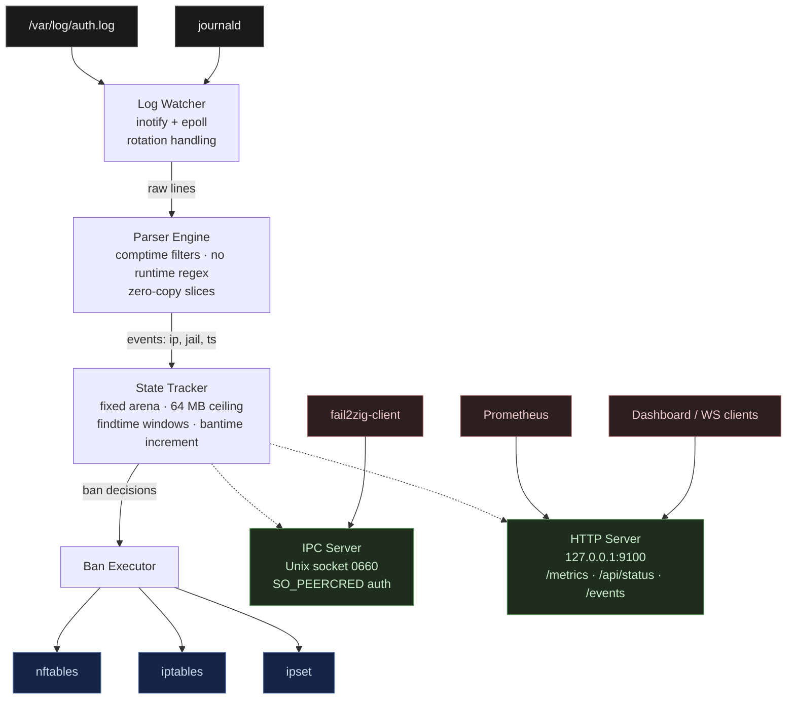

# fail2zig

> A modern intrusion prevention system. Single binary. Zero dependencies.

Your security tool shouldn't be the vulnerability. fail2zig is a drop-in
replacement for fail2ban — written in Zig, shipped as a single static binary,
with zero runtime dependencies and a parser that can't be made to allocate
unbounded memory by the traffic it's supposed to be stopping.

<!-- badges: CI | release | license — to be filled in by OPS in Phase 8.2 -->
<!--  -->
<!--  -->
<!--  -->

---

## Quick start

```bash
# 1. Build from source (or download a prebuilt binary — see Installation)
zig build -Doptimize=.ReleaseSafe

# 2. Import your existing fail2ban config
./zig-out/bin/fail2zig --import-config /etc/fail2ban

# 3. Run
./zig-out/bin/fail2zig --config /etc/fail2zig/config.toml
```

---

## Why fail2zig

- **Single static binary.** Copy it to any Linux server. No Python, no packages,
  no package manager. Works on distroless containers, minimal VMs, OpenWrt.
- **Zero runtime dependencies.** The binary is the complete trusted computing
  base. No shell-out to `nft`, `iptables`, or any other CLI. fail2zig speaks
  netlink directly to the kernel for every firewall operation — see
  [docs/architecture/zero-dependencies.md](docs/architecture/zero-dependencies.md)
  for why this matters for a security tool, and how we verify it.
- **Hard memory ceiling.** Pre-allocated arenas with a configurable cap (default
  64 MB). Memory usage does not grow under sustained brute-force or DDoS
  conditions. Behavior at the ceiling is operator-defined via eviction policy.
- **Comptime-generated parsers.** Built-in filter patterns are compiled into
  specialized match functions at build time — no regex engine in the process,
  no unbounded pattern execution on attacker-controlled input.
- **Zero-copy hot path.** The log line → parse → state update → ban decision
  path performs no heap allocation on the common case.
- **Fail closed.** If the firewall backend cannot be initialized, fail2zig
  exits rather than running unprotected.
- **50x parse throughput target.** See [Benchmarks](#benchmarks).

---

## Features

The following are implemented and passing tests as of Phase 6.

### Parser engine

Comptime DSL compiles pattern definitions into specialized `MatchFn` functions
per pattern at build time. `<IP>`, `<HOST>`, `<TIMESTAMP>`, and `<*>` tokens
produce zero-alloc parse paths. A multi-pattern `Matcher` adds min-length and
first-byte early-exit probes. The entire hot path is verified to make zero
allocations via `FailingAllocator` in tests.

### Native config format

TOML subset (`engine/config/native.zig`) with full schema validation. Unknown
keys are rejected with line and column context — typos are not silently ignored.
See [Configuration](#configuration) for a minimal example.

### fail2ban config import

`fail2zig --import-config [<dir>]` reads a fail2ban config tree
(`jail.conf` + `jail.local` + `jail.d/*.conf` + `filter.d/`) and writes a
native `fail2zig.toml`. The importer:

- Merges jail.conf → jail.local overrides → jail.d/ in lexical order
- Translates Python regex patterns to the fail2zig DSL where possible
- Maps fail2ban action names to native backends (iptables-\* → iptables,
  nftables-\* → nftables, ipset-\* → ipset)
- Prints a migration report: jails imported, filters translated, warnings

Supported fail2ban features: `enabled`, `logpath`, `maxretry`, `findtime`,
`bantime`, `bantime.increment`, `bantime.factor`, `bantime.multiplier`,
`ignoreip`, backend selection, recidive jail.

### Firewall backends

Backend-agnostic dispatch; the best available backend is detected at startup:

| Backend | Implementation | Notes |
|---------|---------------|-------|
| nftables | netlink (`engine/firewall/nftables.zig`) | Preferred on modern kernels |
| iptables | argv subprocess (`engine/firewall/iptables.zig`) | Fallback |
| ipset | argv subprocess (`engine/firewall/ipset.zig`) | High-volume ban lists |

eBPF/XDP (NIC-level packet drop) is architected but ships in Phase 2.

### Ban lifecycle

- Per-IP 128-slot ring buffer of attempt timestamps for sliding `findtime` windows
- Ban count tracking with linear and exponential bantime increment formulas,
  capped at `bantime_increment_max_bantime`
- CIDR-based ignore list (IPv4 `/0`–`/32`, IPv6 `/0`–`/128`); ignored IPs
  short-circuit before any state update
- Three eviction policies when the state table is full: `evict_oldest`,
  `ban_all_and_alert`, `drop_oldest_unbanned`
- State persisted to a binary file on clean shutdown; atomic save (write-to-temp
  + fsync + rename); CRC32-validated on load; graceful recovery on corrupt state

### IPC and client

Unix domain socket server at `/run/fail2zig/fail2zig.sock` (mode 0660,
`SO_PEERCRED` peer auth). Length-prefixed binary protocol; max 8 concurrent
clients; 1 MiB frame cap.

`fail2zig-client` subcommands:

| Command | Description |
|---------|-------------|
| `status` | Daemon uptime, active bans, parse rate, memory usage |
| `ban <ip> --jail <name>` | Add an IP ban to a jail |
| `unban <ip> [--jail <name>]` | Remove a ban |
| `list [--jail <name>]` | List active bans, optionally filtered by jail |
| `jails` | List configured jails and their status |
| `reload` | Signal the daemon to reload config (stub in v0.1) |
| `version` | Print daemon version |
| `completions <bash\|zsh\|fish>` | Print shell completion script |

Global client flags: `--socket <path>`, `--output table|json|plain`,
`--no-color`, `--timeout <ms>`.

### Prometheus metrics and WebSocket events

HTTP server binds `127.0.0.1:9100` by default (configurable):

- `GET /metrics` — Prometheus text exposition with per-jail `{jail="..."}` labels
- `GET /api/status` — JSON status (identical payload to IPC `status`)
- `GET /events` — WebSocket upgrade (RFC 6455); broadcasts `attack_detected`,
  `ip_banned`, `ip_unbanned`, and `metrics` events; max 16 clients

Metrics exposed: `lines_parsed`, `lines_matched`, `bans_total`, `unbans_total`,
`active_bans`, `parse_errors`, `memory_bytes_used`, all per-jail.

### Built-in filters (15)

| Category | Filters |
|----------|---------|
| SSH | `sshd` (9 patterns: OpenSSH 7.x / 8.x / 9.x auth failures, invalid user, PAM, disconnect, bad protocol, reverse mapping) |
| Web | `nginx-http-auth`, `nginx-limit-req`, `nginx-botsearch`, `apache-auth`, `apache-badbots`, `apache-overflows` |
| Mail | `postfix`, `dovecot`, `courier` |
| DNS | `named-refused` (BIND) |
| FTP | `vsftpd`, `proftpd` |
| Database | `mysqld-auth` |
| Meta | `recidive` (escalates repeat offenders by matching fail2zig's own ban log) |

Filter names accept both hyphenated and underscore forms
(`nginx-http-auth` ≡ `nginx_http_auth`).

---

## Benchmarks

Preliminary numbers; final benchmarks will be published with the v0.1.0 release.

| Metric | Target | Notes |
|--------|--------|-------|
| Parse throughput | ≥50x fail2ban | Comptime parsers vs Python regex |
| Memory under attack | ≤64 MB (configurable ceiling) | 10K unique IPs/min, 30 min sustained |
| Cold-start to first ban | <100 ms | Process start → first firewall rule active |
| Binary size (x86_64-linux-musl, stripped) | ≤5 MB | |

These are design targets from the PRD, not measured results. Reproducible
benchmark suite ships in Phase 7/8.

---

## Comparison

| | fail2ban | SSHGuard | CrowdSec | fail2zig |
|---|---|---|---|---|
| Language | Python | C | Go | Zig |
| Deployment | Package + runtime | Single binary | Binary + cloud | Single static binary |
| Runtime deps | Python 3 + libs | libc | Go runtime | None |
| Config format | INI (jail.conf) | Custom | YAML | TOML (native) + fail2ban compat |
| Migration path | — | Manual | Manual | `--import-config /etc/fail2ban` |
| Memory ceiling | No (GC) | N/A | No | Hard configurable cap |
| Static binary | No | Partial | No | Yes (musl-linked) |
| Banning mechanism | iptables/nftables | pf/iptables/nftables | iptables/nftables + cloud API | nftables/iptables/ipset; eBPF/XDP in Phase 2 |

fail2zig is pre-1.0. The table reflects current design and shipped
capability, not marketing claims.

---

## Architecture



---

## Installation

### Prebuilt binary

Prebuilt musl-linked static binaries will be available at
[GitHub Releases](https://github.com/ul0gic/fail2zig/releases) once v0.1.0
is tagged. Checksums will be published alongside each release artifact.

### Build from source

Requirements: [Zig 0.14.x](https://ziglang.org/download/).

```bash
git clone https://github.com/ul0gic/fail2zig
cd fail2zig

# Production build (safety checks retained — required for parser paths)
zig build -Doptimize=.ReleaseSafe

# Binaries land in zig-out/bin/
ls zig-out/bin/
# fail2zig
# fail2zig-client
```

Cross-compile static musl binaries for all supported targets:

```bash
zig build -Dtarget=x86_64-linux-musl  -Doptimize=.ReleaseSafe
zig build -Dtarget=aarch64-linux-musl -Doptimize=.ReleaseSafe
zig build -Dtarget=armv7-linux-musleabihf  -Doptimize=.ReleaseSafe
zig build -Dtarget=mips-linux-musl    -Doptimize=.ReleaseSafe
```

All four targets produce static binaries with no runtime dependencies. The
armv7 target covers Raspberry Pi 3 and older ARM hardware. The mips target
covers OpenWrt routers.

---

## Configuration

Copy `deploy/fail2zig.toml.example` to `/etc/fail2zig/config.toml` and edit.
Below is a minimal working config:

```toml
[global]
socket_path        = "/run/fail2zig/fail2zig.sock"
state_file         = "/var/lib/fail2zig/state.bin"
memory_ceiling_mb  = 64
metrics_bind       = "127.0.0.1"
metrics_port       = 9100

[defaults]
bantime    = 600    # seconds
findtime   = 600    # sliding window
maxretry   = 5
banaction  = "nftables"
ignoreip   = ["127.0.0.1/8", "::1"]

[jails.sshd]
enabled  = true
filter   = "sshd"
logpath  = ["/var/log/auth.log", "/var/log/secure"]
maxretry = 3
bantime  = 3600
bantime_increment_enabled    = true
bantime_increment_formula    = "exponential"
bantime_increment_multiplier = 2
bantime_increment_max_bantime = 604800
```

Validate config without running:

```bash
fail2zig --validate-config --config /etc/fail2zig/config.toml
```

### Migrate from fail2ban

```bash
# Translate /etc/fail2ban/ into /etc/fail2zig/config.toml
fail2zig --import-config /etc/fail2ban --import-output /etc/fail2zig/config.toml
```

The importer prints a migration report showing jails imported, filters
translated, and any warnings for constructs that need manual attention
(lookaheads, backreferences, custom Python filter code).

Full config reference: [docs/config-reference.md](docs/config-reference.md)
(published in Phase 8).

---

## CLI usage

### Daemon (`fail2zig`)

```
fail2zig [OPTIONS]

OPTIONS:
  --config <path>           Config file (default: /etc/fail2zig/config.toml)
  --foreground              Run in foreground (v0.1: only mode)
  --validate-config         Load and validate config, print result, exit
  --test-config             Alias for --validate-config
  --import-config [<dir>]   Import fail2ban config (default: /etc/fail2ban)
  --import-output <path>    Output path for imported config
  --version, -V             Print version and exit
  --help, -h                Print help and exit

EXIT CODES:
  0  success
  1  config invalid, or zero jails imported
  2  hard parse error on import
```

### Client (`fail2zig-client`)

```
fail2zig-client [GLOBAL FLAGS] <COMMAND>

GLOBAL FLAGS:
  --socket <path>    Unix socket (default: /run/fail2zig/fail2zig.sock)
  --output <fmt>     table | json | plain  (default: table)
  --no-color         Disable ANSI color
  --timeout <ms>     Timeout in milliseconds (default: 5000)
  --version, -V      Print client version (no daemon call)
  --help, -h         Print help and exit

COMMANDS:
  status                          Daemon health, uptime, active bans, parse rate
  ban <ip> --jail <name>          Add a ban (--duration <seconds> optional)
  unban <ip> [--jail <name>]      Remove a ban
  list [--jail <name>]            List active bans
  jails                           List configured jails
  reload                          Signal daemon to reload config
  version                         Print daemon version
  completions <bash|zsh|fish>     Print shell completion script

EXIT CODES:
  0  success
  1  daemon returned an error
  2  bad args or invalid input
  3  connection failed (daemon unreachable, permission denied, timeout)
```

Shell completions for your current shell:

```bash
fail2zig-client completions bash >> ~/.bash_completion
fail2zig-client completions zsh  > ~/.zsh/completions/_fail2zig-client
fail2zig-client completions fish > ~/.config/fish/completions/fail2zig-client.fish
```

---

## systemd setup

A systemd unit file will be provided at `deploy/fail2zig.service` in Phase 8
(OPS agent). It will configure `RuntimeDirectory=fail2zig`, `Group=fail2zig`,
and the capability bounding set (`CAP_NET_ADMIN`, `CAP_DAC_READ_SEARCH`).

Until then, run the daemon directly:

```bash
sudo fail2zig --foreground --config /etc/fail2zig/config.toml
```

---

## Security

fail2zig runs as root with the minimum capabilities required: `CAP_NET_ADMIN`
for firewall rule management and `CAP_DAC_READ_SEARCH` for reading
system log files.

Key posture:

- **No runtime interpreter.** The binary is the complete trusted computing
  base. No Python, no scripting engine, no dynamic code loading.
- **Fail closed.** If the firewall backend fails to initialize, the daemon
  exits rather than running without protection.
- **Bounded memory.** A hard ceiling (default 64 MB) is enforced at the
  allocator level. Attack traffic cannot cause unbounded growth.
- **Comptime parsers.** Attacker-controlled log lines never reach a regex
  engine. Built-in patterns are specialized match functions compiled at build
  time. User patterns use a minimal purpose-built matcher with strict length
  limits.
- **Atomic state writes.** Ban state is written via write-to-temp + fsync +
  rename to prevent corruption on crash.
- **O_CLOEXEC everywhere.** File descriptors are not leaked to child processes.

The full threat model is at [web/src/pages/security.astro](web/src/pages/security.astro).

---

## Project status

Phase 6 of 10 complete. Phase 7 (hardening and testing — fuzz suite,
integration tests, benchmarks) is in progress. Phase 8 (docs and DevOps —
CI/CD, release pipeline, man pages) follows.

v0.1.0 tag targets completion of the Phase 7/8 gate. This is pre-release
software. The core daemon, parser, firewall backends, IPC, and filter library
are implemented. The daemon is not yet packaged for any distribution and has
not had an external security audit.

Current test count: 513 passing, zero regressions, zero leaks.

---

## Contributing

Read `.claude/CLAUDE.md` for architecture context and the agent assignment
map. Read `.project/build-plan.md` for current task status.

Standards:

- `zig fmt src/` is law — run before every commit
- `zig build test` must pass with zero failures and zero leaks
- Zero compiler warnings; `zig build -Doptimize=.ReleaseSafe` must be clean
- Every public function and exported type gets a doc comment
- No `@panic` in production code — propagate errors explicitly
- All tests use `std.testing.allocator` for leak detection

To run tests with a filter:

```bash
zig build test -Dtest-filter=parser
```

---

## License

fail2zig is licensed under the **GNU Affero General Public License v3.0**
(AGPL-3.0). See the `LICENSE` file for the full text.

In plain terms:

- You can run, read, fork, modify, and redistribute fail2zig.
- If you modify it, your modifications are also AGPL-3.0 and must be published
  on request — including when you only expose the software over a network
  (the "network use is distribution" clause is the whole point of AGPL).
- Internal commercial use is fine. Self-hosting is fine. Forking for your own
  needs is fine. Publishing a fork under a different name is fine.

The AGPL covers **code rights**. Brand, name, and identity are separate — see
the Trademark section below.

## Trademark

"fail2zig", the fail2zig wordmark, and the fail2zig logo are trademarks of the
project maintainer. Trademark rights are asserted immediately (™) and
registration is planned.

You may fork and modify the code under the AGPL-3.0. You may **not**:

- use the "fail2zig" name, wordmark, or logo for a derived, modified, or
  repackaged distribution;
- imply your fork is the official project, endorsed by the maintainer, or
  affiliated with fail2zig;
- use the name or branding for a commercial hosted service offering.

If you ship a fork, give it a different name. This separation — permissive
code rights, strict name rights — is the same model used by Redis (pre-2024),
Elasticsearch, and Grafana Labs. Contact the maintainer for any trademark
licensing question.
