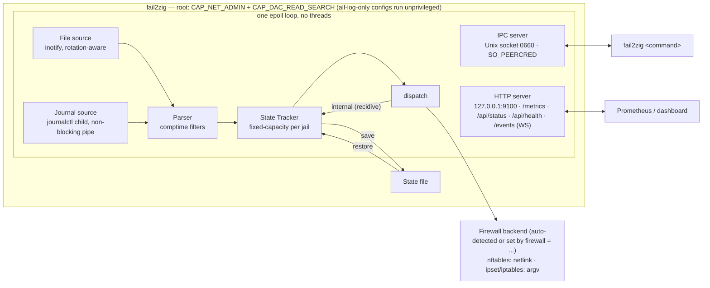

<div align="center">

# fail2zig

**A Linux intrusion prevention daemon written in Zig.**

[](https://github.com/ul0gic/fail2zig/actions/workflows/ci.yml)
[](https://scorecard.dev/viewer/?uri=github.com/ul0gic/fail2zig)
[](LICENSE)
[](https://ziglang.org/download/)
[](#installation)
[](https://github.com/ul0gic/fail2zig/releases/latest)

</div>

fail2zig is an intrusion prevention daemon inspired by fail2ban — written in Zig, as one static
executable, with a parser that cannot be made to allocate unbounded
memory by the traffic it's supposed to be stopping.

The importer translates supported fail2ban jail settings into native TOML and reports
unsupported configurations that need operator changes. Broader supported migration and
bounded native custom rules remain development work; exact fail2ban compatibility is not promised.

This checkout is **0.3.1-dev**, unpublished. Its default [native runtime](docs/parity/native-runtime.md)
uses embedded SQLite for source receipts, consumer state and retry decisions, with durable
firewall intent and confirmed history. Selected file/journal restart, enforcement and recovery
checks pass across the three backends and both address families. Full N2 fault/platform
qualification remains open. Existing binary state and unsupported settings are refused;
there is no automatic migration. Replaced legacy consumers are being retired after their
replacement acceptance.
The corrected direction removes the remaining project-owned Python
and consolidates daemon/admin functions into one self-contained executable. OS requirements
remain explicit: journal input uses the host's journald and journalctl. That integration is
retained; the application does not need to embed its own journal reader. The broader
transformation is not complete. See
[current components](docs/parity/p2-components.md) and [delivery contract](docs/parity/profile-contract.md).

---

## Table of contents

- [Quick start](#quick-start)
- [Why fail2zig](#why-fail2zig)
- [Architecture](#architecture)
- [Installation](#installation)
- [Configuration](#configuration)
- [CLI usage](#cli-usage)
- [Features](#features)
- [Benchmarks](#benchmarks)
- [Comparison](#comparison)
- [Project structure](#project-structure)
- [Documentation](#documentation)
- [Contributing](#contributing)
- [License & trademark](#license)

---

## Quick start

```bash
# 1. Install (downloads the static musl binary, SHA256-verifies, installs
#    systemd unit + example config)
curl -fsSL https://github.com/ul0gic/fail2zig/raw/main/scripts/install.sh | sudo bash

# 2. (Optional) Migrate from fail2ban
sudo fail2zig --import-config /etc/fail2ban \
              --import-output /etc/fail2zig/config.toml

# 3. Validate config, then enable the service
sudo fail2zig --validate-config --config /etc/fail2zig/config.toml
sudo systemctl enable --now fail2zig

# 4. Check the daemon
sudo fail2zig status
```

One executable serves every entry point: the daemon, the administration commands,
offline `rule-test` and `migrate`. It uses compiled-in filters and needs no Python
runtime. Journald input and the ipset/iptables backends require their documented host
tools; the nftables backend talks directly to the kernel.

The installer pulls from the
[latest GitHub Release](https://github.com/ul0gic/fail2zig/releases/latest)
and verifies every asset against the published `SHA256SUMS` before placing
anything on disk. Pin a specific version with
`FAIL2ZIG_VERSION=v0.3.0` or inspect the script first with
`curl -fsSL … | less`.

---

## Why fail2zig

- **Static delivery.** Current releases provide a daemon and companion client for
  supported Linux targets. Consolidating them into one executable is planned.
- **Direct nftables enforcement.** No nft userspace package is required for that
  backend. Current ipset/iptables modes invoke their tools with fixed argv, and
  journald uses journalctl. See the [delivery contract](docs/parity/profile-contract.md)
  for current dependencies and the planned standalone runtime.
- **Bounded under attack.** The IP state tracker is a fixed-capacity map.
  Half of `memory_ceiling_mb` (default 64 MB) is split evenly across the
  enabled jails plus one spare tracker, at roughly 1.5 KB per tracked IP.
  When a tracker is full, the oldest unbanned entry is evicted; this is not
  configurable. The bound is on entries, not a byte budget across every
  allocator.
- **Comptime-generated parsers.** Built-in filter patterns compile into
  specialized match functions at build time. There is no regex engine in the
  process. Attacker-controlled input never reaches a Turing-complete matcher.
- **Zero-copy hot path.** Parsing a log line performs no heap allocation,
  verified with `FailingAllocator` in tests. The state tracker reserves its
  full capacity at first use, so steady-state updates do not allocate either.
- **Fail closed.** If no firewall backend is usable, the daemon exits and
  logs the cause. `on_no_backend = "log-only"` is an explicit opt-in to keep
  running: bans are logged, not applied, and `status`, `/metrics`, and
  `/events` report `DEGRADED` with the cause. It is never silent.
- **fail2ban config import.** `--import-config /etc/fail2ban` translates
  `jail.conf`, its layers and selected assets into a native projection plus
  retained compatibility manifest. The report identifies settings awaiting support.

---

## Architecture


```mermaid
flowchart LR
    subgraph Daemon["fail2zig — root: CAP_NET_ADMIN + CAP_DAC_READ_SEARCH (all-log-only configs run unprivileged)"]
        subgraph Loop["one epoll loop, no threads"]
            FS["File source<br/>inotify, rotation-aware"]
            JS["Journal source<br/>journalctl child, non-blocking pipe"]
            PE["Parser<br/>comptime filters"]
            ST["State Tracker<br/>fixed-capacity per jail"]
            DP["dispatch"]
            IPC["IPC server<br/>Unix socket 0660 · SO_PEERCRED"]
            HTTP["HTTP server<br/>127.0.0.1:9100 · /metrics · /api/status · /api/health · /events (WS)"]
        end
        SF["State file"]
    end

    BE["Firewall backend (auto-detected or set by firewall = ...)<br/>nftables: netlink · ipset/iptables: argv"]
    CLI["fail2zig &lt;command&gt;"]
    PROM["Prometheus / dashboard"]

    FS --> PE
    JS --> PE
    PE --> ST
    ST --> DP
    DP --> BE
    DP -->|"internal (recidive)"| ST
    ST -->|save| SF
    SF -->|restore| ST
    IPC <--> CLI
    HTTP <--> PROM
    DP ~~~ IPC
    DP ~~~ HTTP
```

Deep-dive: [architecture/zero-dependencies](https://fail2zig.com/docs/architecture/zero-dependencies/).

---

## Installation

### Prebuilt binary (recommended)

```bash
curl -fsSL https://github.com/ul0gic/fail2zig/raw/main/scripts/install.sh | sudo bash
```

[`scripts/install.sh`](scripts/install.sh) detects your architecture, resolves
the latest release (or `FAIL2ZIG_VERSION` if set), downloads `fail2zig` +
`SHA256SUMS` from the
[release](https://github.com/ul0gic/fail2zig/releases/latest) asset tree,
verifies the executable's SHA256 against `SHA256SUMS`, creates the `fail2zig`
system group, installs it to `/usr/local/bin` (removing a retired
`fail2zig-client` if one is present), drops the example
config at `/etc/fail2zig/config.toml` (never clobbers an existing one), and
installs the hardened `fail2zig.service` unit under
`/etc/systemd/system/`. It does **not** auto-start the daemon — audit the
config, then `systemctl enable --now fail2zig` when ready.

**Supported targets** (release assets are named `fail2zig-<tag>-<triple>`):

| Target | Hardware | Validation |
|--------|----------|------------|
| `x86_64-linux-musl` | servers, VPS | real systems, live honeypot |
| `aarch64-linux-musl` | ARM64 servers, Raspberry Pi 3+ | cross-build + CI static check |
| `arm-linux-musleabihf` | armv7 hard-float boards | cross-build + CI static check |
| `mips-linux-musleabi` | big-endian MIPS32r2 routers, soft-float | qemu-user-static only |
| `mipsel-linux-musleabi` | little-endian MIPS32r2 routers, soft-float | qemu-user-static only |

All five are static musl binaries. Legacy firewall modes and journal ingestion
require their documented external tools. The mips pair
targets the soft-float ABI common on OpenWrt-class hardware; CI runs
`--version` under `qemu-mips[el]-static` on every build, but no one has yet
reported a run on real MIPS hardware. Hard-float MIPS (`musleabihf`) is not
built until a real target asks for it (ADR-012).

### Dry-run / inspect the installer

```bash
# Inspect before piping to root
curl -fsSL https://github.com/ul0gic/fail2zig/raw/main/scripts/install.sh | less

# See what would happen without writing anything
curl -fsSL https://github.com/ul0gic/fail2zig/raw/main/scripts/install.sh | sudo bash -s -- --dry-run

# Install from a local checkout instead of downloading
sudo scripts/install.sh --local-bin zig-out/bin
```

### Manual install

If you'd rather skip the script:

```bash
# 1. Download the binary + manifest for your arch
VERSION=v0.3.0
ARCH=x86_64-linux-musl   # or aarch64-linux-musl, arm-linux-musleabihf, mips-linux-musleabi, mipsel-linux-musleabi
curl -fsSLO "https://github.com/ul0gic/fail2zig/releases/download/${VERSION}/fail2zig-${VERSION}-${ARCH}"
curl -fsSLO "https://github.com/ul0gic/fail2zig/releases/download/${VERSION}/SHA256SUMS"

# 2. Verify (bail if any line fails)
sha256sum --check --ignore-missing SHA256SUMS
# Optional: verify the SLSA build provenance (needs the gh CLI)
gh attestation verify "fail2zig-${VERSION}-${ARCH}" --repo ul0gic/fail2zig

# 3. Install
sudo install -m 0755 "fail2zig-${VERSION}-${ARCH}" /usr/local/bin/fail2zig
sudo groupadd --system fail2zig 2>/dev/null || true
```

Then follow the [systemd setup](#systemd-setup) block below.

### Build from source

Requires [Zig 0.14.x](https://ziglang.org/download/); CI pins 0.14.1.
Zig 0.15 and later do not build this tree (ADR-012).

```bash
git clone https://github.com/ul0gic/fail2zig
cd fail2zig

# Production build (safety checks retained on parser + network paths)
zig build -Doptimize=ReleaseSafe

# The one executable lands in zig-out/bin/
ls zig-out/bin/
# fail2zig
```

### Cross-compile

Every shipped target (see [.github/workflows/release.yml](.github/workflows/release.yml)):

```bash
zig build -Dtarget=x86_64-linux-musl     -Doptimize=ReleaseSafe
zig build -Dtarget=aarch64-linux-musl    -Doptimize=ReleaseSafe
zig build -Dtarget=arm-linux-musleabihf  -Doptimize=ReleaseSafe
zig build -Dtarget=mips-linux-musleabi   -Doptimize=ReleaseSafe
zig build -Dtarget=mipsel-linux-musleabi -Doptimize=ReleaseSafe
```

All produce statically linked musl binaries; selected backends may require external tools. Use
the float-ABI-suffixed mips triples: the bare `mips-linux-musl` triple has no
musl libc in any Zig release. To run a mips build on an x86_64 host:

```bash
qemu-mips-static zig-out/bin/fail2zig --version   # qemu-mipsel-static for mipsel
```

### systemd setup

If you used `scripts/install.sh`, the unit file is already in place — skip to
[Configuration](#configuration).

From a repo checkout:

```bash
sudo install -m 0644 deploy/fail2zig.service /etc/systemd/system/
sudo install -d -m 0750 /etc/fail2zig
sudo install -m 0640 deploy/fail2zig.toml.example /etc/fail2zig/config.toml
sudo systemctl daemon-reload
sudo systemctl enable --now fail2zig
```

From a downloaded release (the same files are published alongside
the binaries):

```bash
VERSION=v0.3.0
for f in fail2zig.service fail2zig.toml.example; do
  curl -fsSLO "https://github.com/ul0gic/fail2zig/releases/download/${VERSION}/${f}"
done
sudo install -m 0644 fail2zig.service /etc/systemd/system/
sudo install -d -m 0750 /etc/fail2zig
sudo install -m 0640 fail2zig.toml.example /etc/fail2zig/config.toml
sudo systemctl daemon-reload
sudo systemctl enable --now fail2zig
```

The shipped unit is hardened: `ProtectSystem=strict`, `NoNewPrivileges=yes`,
`CapabilityBoundingSet=CAP_NET_ADMIN CAP_DAC_READ_SEARCH`,
`RuntimeDirectory=fail2zig` (auto-created on every start), no home
directories, no device nodes, no kernel tunables. `systemd-analyze security
fail2zig` scores 2.4 (OK).

---

## Configuration

`fail2zig` reads one TOML file — `/etc/fail2zig/config.toml` by default.
The installer and the systemd setup both drop a fully-commented example
there. Edit it, validate, restart.

The file must not be world-writable or writable by a non-root group; the
daemon refuses to start and prints the `chmod 0640` fix. Unknown and
duplicate keys are rejected with `file:line:col`, the key, and its section.

A minimal working config:

```toml
[global]
socket_path        = "/run/fail2zig/fail2zig.sock"
state_file         = "/var/lib/fail2zig/state.bin"
memory_ceiling_mb  = 64
metrics_enabled    = true         # false: no HTTP/WebSocket listener; IPC and the client still work
metrics_bind       = "127.0.0.1"
metrics_port       = 9100
firewall           = "auto"       # probes nftables, ipset, iptables; naming one probes only it

[defaults]
bantime    = 600      # seconds
findtime   = 600      # sliding window for counting attempts
maxretry   = 5        # attempts inside findtime before a ban
banaction  = "nftables"   # nftables / iptables / ipset all mean enforce (backend comes from [global] firewall); "log-only" observes
ignoreip   = ["127.0.0.1/8", "::1"]

# bantime_increment controls how repeat offenders get longer bans.
bantime_increment_enabled     = true
bantime_increment_formula     = "exponential"
bantime_increment_multiplier  = 2
bantime_increment_max_bantime = 604800   # cap at 7 days

[jails.sshd]
enabled = true
filter  = "sshd"
# source = "auto" (the default) reads the systemd journal on modern minimal
# systemd boxes where /var/log/auth.log is absent, and tails the files below
# when they exist. Force it with source = "journald" or source = "file".
logpath = ["/var/log/auth.log", "/var/log/secure"]

[jails.nginx-botsearch]
enabled = true
filter  = "nginx-botsearch"
logpath = ["/var/log/nginx/access.log"]
```

After editing:

```bash
sudo fail2zig --validate-config --config /etc/fail2zig/config.toml
sudo systemctl restart fail2zig
sudo fail2zig status
```

Full schema and every option: [reference/config](https://fail2zig.com/docs/reference/config/).

### Migrate from fail2ban

```bash
fail2zig --import-config /etc/fail2ban \
         --import-output /etc/fail2zig/config.toml
```

In this development checkout, configuration order is `jail.conf` → sorted
`jail.d/*.conf` → `jail.local` → sorted `jail.d/*.local`, including ordered
before/after includes. The importer retains raw settings, parameterized assets and
provenance in a protected manifest alongside the native configuration projection.

Supported native settings can be used after review. Custom filters, scoped actions and
other unsupported semantics remain disabled and marked `compatibility_pending`; imported
regexes are not automatically executed or replaced by a same-named builtin filter.
The migration report identifies pending work. This preparation is not a complete or
live migration from fail2ban. See [configuration preparation](docs/parity/p2-components.md#configuration-and-migration-preparation).

Step-by-step guide: [guides/migration-from-fail2ban](https://fail2zig.com/docs/guides/migration-from-fail2ban/).

The journaled cutover and rollback (`fail2zig migrate inspect|snapshot|plan|validate|cutover|status|rollback`)
and the mapping of every `fail2ban-client` invocation to its native command, exit class
and JSON schema are in
[docs/operations/command-migration.md](docs/operations/command-migration.md).

---

## CLI usage

One executable, three modes. Full reference: [docs/man/fail2zig.1](docs/man/fail2zig.1);
script migration: [docs/operations/command-migration.md](docs/operations/command-migration.md).

### Daemon — `fail2zig [daemon]`

```
fail2zig [OPTIONS]

OPTIONS:
  --config <path>           Config file (default: /etc/fail2zig/config.toml)
  --foreground              Run in foreground (only mode)
  --validate-config         Load and validate config, exit (--test-config is an alias)
  --import-config [<dir>]   Import fail2ban config (default: /etc/fail2ban)
  --import-output <path>    Output path for imported config
  --version, -V             Print version and exit
  --help, -h                Print help and exit
```

Under systemd the unit is `Type=notify`: `READY=1` is sent only after configuration,
storage, every source and enforcing protection are admitted; `RELOADING=1`/`READY=1`
bracket a live reload (`ExecReload` sends `SIGHUP`); `STOPPING=1` precedes exit;
`SIGUSR1` reopens `global.log_target`. No socket unit ships.

### Administration — `fail2zig <command>`

| Command | Description |
|---------|-------------|
| `status` | Protection state (`active` / `log-only` / `mixed` / `DEGRADED (<cause>)`), backend, storage phase, generation, active and total bans |
| `jails` | Configured jails: enabled, paused, health, thresholds, action, source |
| `list [--jail <name>]` | Active bans |
| `ban <ip> --jail <name> [--duration <s>] [--scope host\|net <cidr>]` | Manual ban (exactly one jail; `net` needs nftables or ipset) |
| `unban <ip> --jail <name> [--scope host\|net <cidr>]` | Release a ban |
| `reload` | Propose the configuration file as a new generation: `noop`, `applied`, `rejected` or `restart_required` |
| `history [--jail <name>] [--limit <n>] [--cursor <token>]` | Page through confirmed ban history |
| `history reset <ip> (--jail <name> \| --all)` | Reset an address's durable history |
| `jail enable\|disable\|pause\|resume <name>` | Administer one jail |
| `config` | Effective configuration and generation (redacted for non-administrators) |
| `version` | Daemon version over the socket |
| `completions <bash\|zsh\|fish>` | Shell completion script |
| `help [command]` | Help |

Global flags: `--socket <path>`, `--output table|json|plain`, `--no-color`,
`--timeout <ms>`. Members of the `fail2zig` group may run the read-only commands
through the 0660 socket; mutations require uid 0 or the daemon uid.

Exit classes (every command): `0` success · `1` rejected or absent · `2` usage ·
`3` daemon unavailable · `4` partial (kernel confirmation incomplete) · `5` uncertain.

### Offline — `fail2zig rule-test` and `fail2zig migrate`

```bash
# Evaluate a log against a compiled service or a native rule file; no daemon needed.
fail2zig rule-test --file /var/log/auth.log --service sshd --tz-offset 0 --output table
fail2zig rule-test --record 'Denied login for x from 203.0.113.9 port 2201' --rule-file rule.json

# Read-only migration preparation, then the journaled cutover.
fail2zig migrate inspect --source-dir /etc/fail2ban
```

`rule-test` samples carry the extracted identity and reason, never the raw line unless
`--print-lines` is given. Exit `0` processed, `1` refused, `2` usage.

---

## Features

### Parser engine

Comptime DSL compiles pattern definitions into specialized `MatchFn` functions
at build time. `<IP>`, `<HOST>`, `<TIMESTAMP>`, and `<*>` tokens produce
zero-alloc parse paths. A multi-pattern `Matcher` adds min-length and
first-byte early-exit probes. The parser is verified zero-alloc via
`FailingAllocator`; the state tracker reserves its capacity at first use.

### Firewall backends

| Backend | Implementation | Notes |
|---------|----------------|-------|
| nftables | netlink, no shell-out (`engine/firewall/nftables.zig`) | Preferred on modern kernels |
| iptables | argv subprocess (`engine/firewall/iptables.zig`) | Legacy fallback |
| ipset | argv subprocess (`engine/firewall/ipset.zig`) | High-cardinality ban lists |

`[global] firewall` selects the backend. `"auto"` (the default) probes
nftables, then ipset, then iptables, and uses the first that is usable.
`"nftables"`, `"ipset"`, or `"iptables"` probes only that backend. If it is
unusable, `on_no_backend` decides: `"fail-closed"` (the default) exits with
the cause logged; `"log-only"` runs DEGRADED, shown as
`Protection: DEGRADED (<cause>)` by `fail2zig status` and in
`/api/status`. There is no fallback to another backend.

`banaction` does not select a backend. Its values `nftables`, `iptables`,
and `ipset` are accepted for fail2ban compatibility and all mean enforce
with the selected backend; `log-only` observes.

eBPF/XDP (NIC-level drop) is on the roadmap; it is not scheduled.

### Ban lifecycle

- Per-IP 128-slot ring buffer of attempt timestamps for sliding `findtime` windows
- Linear and exponential `bantime_increment`, capped at `bantime_increment_max_bantime`
- CIDR-based ignore list (IPv4 `/0`–`/32`, IPv6 `/0`–`/128`); ignored IPs
  short-circuit before any state update
- Fixed-capacity tracker per jail; when full, the oldest unbanned entry is
  evicted (sizing in [Why fail2zig](#why-fail2zig))
- Atomic state persistence (write-to-temp + fsync + rename); CRC32-validated
  on load; restored bans are reconciled into the firewall on restart
- State file format v4 records whether each ban was enforced; v1–v3 files
  still load. A `state_file` under `/run` or on tmpfs logs a warning at
  startup: it will not survive a reboot

The unpublished candidate reports the state/temporary-file path and underlying creation
error when saving fails. A failed state save prevents advancing the saved journal cursor;
failed journal flushes remain pending for retry. This improves recovery but does not make
the two files a single crash-atomic transaction. The configured state directory must already
exist and be writable inside the daemon's service environment. The shipped systemd unit
provides `/var/lib/fail2zig`; custom paths must also satisfy its filesystem restrictions.
The candidate refuses startup with exit code 1 if its persistence availability check fails,
before firewall initialization or log ingestion. It checks the state path and, when journal
input is selected, the cursor sidecar path. Disposable files test writing, syncing and renaming
without overwriting saved state. The error names the path, operation and OS cause. Repair the
directory or service access and restart; this check cannot guarantee against later disk failures.

### IPC & metrics

- Unix domain socket at `/run/fail2zig/fail2zig.sock` — mode 0660,
  `SO_PEERCRED` authentication, length-prefixed binary protocol, 8 concurrent
  clients, 1 MiB frame cap
- HTTP on `127.0.0.1:9100` — `GET /metrics` (Prometheus), `GET /api/status`
  (JSON), `GET /api/health` (readiness components: config, storage, sources,
  clock, enforcement, admin; 200 when ready, 503 otherwise), `GET /events` (WebSocket, RFC 6455; broadcasts
  `attack_detected`, `ip_banned`, `ip_unbanned`, `metrics`; max 16 clients)
- `metrics_enabled = false` binds no HTTP listener; the socket and the
  administration commands are unaffected. `metrics_port = 0` is rejected, it does
  not disable the endpoint

### Built-in filters (15)

| Category | Filters |
|----------|---------|
| SSH | `sshd` (9 patterns: authentication failures, invalid users, PAM failures and selected protocol errors) |
| Web | `nginx-http-auth`, `nginx-limit-req`, `nginx-botsearch`, `apache-auth`, `apache-badbots`, `apache-overflows` |
| Mail | `postfix`, `dovecot`, `courier` |
| DNS | `named-refused` (BIND) |
| FTP | `vsftpd`, `proftpd` |
| Database | `mysqld-auth` |
| Meta | `recidive` (escalates repeat offenders — fed in-process from confirmed bans in other jails, `source = "internal"`; no ban log to tail) |

Full reference: [reference/filters](https://fail2zig.com/docs/reference/filters/).
Filter names accept hyphenated or underscore forms
(`nginx-http-auth` ≡ `nginx_http_auth`).

---

## Benchmarks

Historical measurements from the reference lab box (x86_64, ReleaseSafe, stripped).
Parser and decision microbenchmarks exclude log delivery and firewall installation;
they do not establish an end-to-end speed advantage over fail2ban.
Reproducible via `make bench` and the `tests/harness/measure.sh` probes.

| Metric | Target | Measured |
|--------|--------|----------|
| Parse throughput (lines/sec) | ≥ 22,000 | **~5.96M** |
| Ban decision latency (p99) | < 1 ms | **932 ns** (p50: 365 ns) |
| Tracked state (50K unique IPs) | Bounded entry count | 21,845 entries resident, 15,606 evictions — cap held |
| Binary size (x86_64-linux-musl, stripped) | ≤ 5 MB | **1.0 MB** daemon · 535 KB client |
| Cold start → ready for events | < 100 ms | Lab-dependent (skips unprivileged hosts) |
| IPC `status` round-trip (p99) | < 50 ms | **< 1 ms** (p50 0.75 ms; 500 round-trips, dev box, not the lab box) |

Benchmark harness and methodology:
[tests/benchmark/README.md](tests/benchmark/README.md). Real-system validation
harness: [tests/harness/README.md](tests/harness/README.md).

---

## Compatibility and operational limits

fail2zig supports built-in filters, per-jail thresholds, ignore lists, escalating
bans, persistence, and nftables/iptables/ipset enforcement. The native format is
TOML; `--import-config` translates supported fail2ban settings and disables
unsupported custom filters with a warning. Review the generated configuration, especially increment formulas and caps: native
escalation settings do not guarantee identical fail2ban semantics.

Compatibility is not complete: runtime custom regex/action scripts and runtime
`set` of thresholds are not implemented by design. `fail2zig reload` applies
`maxretry`, `bantime`, `bantime_kind`, `bantime_increment`, `log_level` and a custom
jail's `ignore_file` live; every other key is reported as `restart_required`.
`maxretry` supports 1–128.
The memory setting sizes bounded tracked state, not every daemon allocation.

Manual bans honor jail defaults, appear in listings/status, and persist. An
address shared by multiple jails stays blocked until its final owner expires or
is removed. Repeating a manual ban extends its expiry without counting a new ban.
iptables and ipset expiry is daemon-managed: their entries remain while the daemon
is stopped, and expiry resumes on restart. nftables also uses kernel timeouts.

The filter regression corpus is in `tests/integration/filter_corpus.json`.
It contains synthetic cases, not a production-log compatibility certification.

---

## Project structure

```
fail2zig/
├── engine/              # Daemon (runs as root)
│   ├── core/            # Event loop, log watcher, parser, state tracker
│   ├── firewall/        # nftables (netlink), iptables, ipset backends
│   ├── config/          # Native TOML + fail2ban jail.conf importer
│   ├── filters/         # Comptime-generated filter library (15 filters)
│   ├── net/             # HTTP metrics + WebSocket event server
│   └── main.zig         # Entry point, CLI args, daemon lifecycle
├── client/              # Administration modules linked into the one executable
├── shared/              # Common types (IPC protocol, IP addresses)
├── tests/               # See tests/README.md for the layout
│   ├── integration/     # Zig integration tests
│   ├── benchmark/       # Zig microbenchmarks (-Dbench=true)
│   ├── fuzz/            # Zig fuzz corpora (parsers, protocol, config)
│   ├── harness/         # Shell-based system harness (lab-box tests)
│   └── e2e/             # Deploy-regression scripts (real install + shipped unit)
├── docs/                # Installable man pages
│   ├── man/             # troff: fail2zig(1), fail2zig.toml(5)
│   └── operations/      # Operator runbooks (command migration, continuity)
├── deploy/              # systemd unit, example config
├── scripts/             # Public installer (scripts/install.sh)
├── .github/workflows/   # CI (ci.yml) + release pipeline (release.yml)
├── build.zig            # Builds the one executable
└── build.zig.zon        # Zig package manifest
```

---

## Documentation

| Kind | Where | What |
|------|-------|------|
| Architecture | [fail2zig.com/docs](https://fail2zig.com/docs/) | Why decisions were made (zero-dependencies deep-dive) |
| Guides | [fail2zig.com/docs](https://fail2zig.com/docs/) | Task-oriented walkthroughs (migration from fail2ban) |
| Reference | [fail2zig.com/docs](https://fail2zig.com/docs/) | Config schema, CLI flags, filter catalogue |
| Man pages | [docs/man/](docs/man/) | `fail2zig(1)`, `fail2zig.toml(5)` |
| Operations | [docs/operations/](docs/operations/) | Command migration from fail2ban-client, continuity boundary |
| Tests | [tests/README.md](tests/README.md) | Unit / integration / benchmark / fuzz / harness layout |

---

## Contributing

fail2zig wants to be the modern replacement for fail2ban — the drop-in
tool that understands the services people actually run in 2026.
Contributors are how it gets there. The codebase is small (~29K lines of
Zig, ~32K with `tests/`), the conventions are boring on purpose, and the contribution surface
is wide open.

### The biggest ask: modern filters

fail2ban's built-in filter library largely stopped expanding around 2015.
The internet moved on. The highest-leverage contribution right now is
**a pattern file for a service you actually run**. Candidates we'd love
to ship:

- **Container + orchestration** — Docker daemon events, Kubernetes API auth, Nomad, container runtime audit logs
- **Reverse proxies** — Traefik, Caddy, Envoy, HAProxy
- **Self-hosted services** — Vaultwarden, Authelia, Keycloak, Gitea, Forgejo, Jellyfin, Immich, Nextcloud, Jenkins
- **LLM endpoints** — Ollama, OpenWebUI, LocalAI — a whole category that post-dates fail2ban
- **Databases** — PostgreSQL, Redis, MongoDB auth failures
- **Observability** — Grafana, Prometheus unauthorized access

Each filter is a handful of log-line patterns plus a few test cases.
`engine/filters/sshd.zig` is the cleanest reference for the shape. Bring
real log lines from a real deployment if you can — that's the gold
standard.

Not a Zig developer? Good filter proposals are welcome as issues too — a
few representative log lines + the name of the service is enough to open
the door.

### Good first contributions

- **Add a filter** for any service listed above (or one that isn't).
- **Improve fail2ban migration output** — if `--import-config` skipped or mistranslated a jail you use, open an issue with the original `jail.conf` stanza.
- **Fix a doc rough edge** — typos, unclear wording, missing context in a `.md` file.
- **Add a test case** to an existing filter that covers an edge case.
- **Benchmark fail2zig on a platform** we don't test and share numbers.
- **Bug report from real deployment** — what broke, what you'd expect.

### Pick your path

| You want to... | Path |
|---|---|
| **Report a security vulnerability** | [GitHub Private Security Advisories](https://github.com/ul0gic/fail2zig/security/advisories/new) — not a public issue. Ack in 48 h, coordinated disclosure. See [SECURITY.md](SECURITY.md). |
| **Report a bug** | [Open an issue](https://github.com/ul0gic/fail2zig/issues/new). Include Zig version (`zig version`), OS (`uname -a`), and a minimal config that reproduces it. |
| **Add a filter for a modern service** | PR directly. Include positive + negative test cases and real log lines if you have them. |
| **Fix a typo, doc, or small bug** | PR directly. No issue needed. |
| **Propose a feature** | Open an issue to sketch the shape — saves you building something that won't fit. |
| **Contribute a larger change** | Issue first so we can align, then PR. Keep PRs single-purpose. |

### Licensing

By opening a pull request, you agree your contribution is licensed
**AGPL-3.0-or-later** — the same license as the rest of the project. No
CLA, no sign-off ceremony. `git blame` is the authorship record.

Trademark on the "fail2zig" name and logo is separate and not granted by
contributing — see [Trademark](#trademark) below.

### Development setup

```bash
git clone https://github.com/ul0gic/fail2zig
cd fail2zig
zig build test          # Current dependency-bearing foundations are described below
```

**Requires:**

- [Zig 0.14.x](https://ziglang.org/download/); CI pins 0.14.1. Zig 0.15 and later do not build this tree (ADR-012).

The current P2 test foundations still require Python and dynamic libraries for applicable
paths; see [component status](docs/parity/p2-components.md). The planned Zig-only project
tooling gate is not implemented yet.

The marketing site (fail2zig.com) lives in a separate repo and is not covered here.

### Standards

CI enforces these — not because we're precious, because they catch real
bugs early and keep the binary small.

**Zig:**
- `zig fmt engine/ client/ shared/ tests/` before every commit — CI-enforced
- `zig build` and `zig build test` pass, zero failures, zero leaks
- Zero compiler warnings; `zig build -Doptimize=ReleaseSafe` clean
- No `@panic` in production code — propagate errors explicitly
- No `@setRuntimeSafety(false)` without a comment proving the safety invariant
- All tests use `std.testing.allocator` for leak detection
- SPDX header on every `.zig` file (CI-enforced)

### A good PR

- **One purpose per PR.** A bug fix is not a refactor + rename + unrelated cleanup. If the description wants to say "also," split it.
- **Commit messages follow existing style:** `feat(scope): …`, `fix(scope): …`, `docs(scope): …`, `chore(scope): …`. Scope is the directory or module.
- **Description explains *why*.** The diff already shows *what*. If it fixes a bug, link the issue.
- **Tests.** A bug fix includes a regression test that would have failed before the fix. A feature covers the happy path plus at least one error case. Filter contributions include positive + negative log lines.
- **CI green.** If CI is broken on `main`, that's its own PR first.

A PR that hits those marks gets reviewed. Feedback is aimed at landing
the change, not gatekeeping — if something needs adjusting, we'll say
what and why.

### Things we're intentionally not building

Open an issue if you want to argue for any of these — the list is not
immutable, just what we've decided against so far:

- **Windows or macOS support** — Linux-only until v1.0.
- **GUI dashboards inside the daemon** — the `/events` WebSocket is the extension point. Dashboards live outside the daemon.
- **Plugin systems or embedded scripting in the core** — see [architecture/zero-dependencies](https://fail2zig.com/docs/architecture/zero-dependencies/) for the reasoning.
- **SIEM-specific adapters** — fail2zig emits Prometheus metrics + structured JSON; SIEM vendors handle ingestion on their side.
- **Shell-script ban actions** — no `action.d`-style scripts, no `/bin/sh`. nftables is programmed over netlink; the ipset/iptables backends exec a fixed argv when selected.

### Useful Makefile targets

```bash
make build          # Debug build
make test           # zig build test
make bench          # Microbenchmarks
make fuzz           # Fuzz corpus run
make release        # ReleaseSafe native build
make cross          # ReleaseSafe for all five shipped musl targets
make lint           # zig fmt --check, shellcheck, yamllint
make harness-smoke  # Lab-box attack smoke test (requires a Linux host)
```

Run a single test or filter by substring:

```bash
zig build test -Dtest-filter=parser
```

### Review + communication

Everything lives on the repo — issues, PRs, and security advisories.
Keeping it there means the project history is public and searchable; new
contributors can read what was decided and why without joining a chat.

Review timing is best-effort. Small PRs usually get a first look within a
few days; larger ones longer. Security advisories are acknowledged within
48 hours. A gentle ping on a PR untouched for two weeks is welcome.

---

## License

fail2zig is licensed under the **GNU Affero General Public License v3.0 or
later** (AGPL-3.0-or-later). See [LICENSE](LICENSE) for the full text.

In plain terms:

- You can run, read, fork, modify, and redistribute fail2zig.
- If you modify it, your modifications are also AGPL-3.0-or-later and must be
  published on request — including when you only expose the software over a
  network (the "network use is distribution" clause is the whole point of
  AGPL).
- Internal commercial use is fine. Self-hosting is fine. Forking for your
  own needs is fine. Publishing a fork under a different name is fine.

The AGPL covers **code rights**. Brand, name, and identity are separate — see
Trademark below.

## Trademark

"fail2zig", the fail2zig wordmark, and the fail2zig logo are trademarks of
the project maintainer. Trademark rights are asserted immediately (™) and
registration is planned.

You may fork and modify the code under the AGPL-3.0-or-later. You may **not**:

- use the "fail2zig" name, wordmark, or logo for a derived, modified, or
  repackaged distribution;
- imply your fork is the official project, endorsed by the maintainer, or
  affiliated with fail2zig;
- use the name or branding for a commercial hosted service offering.

If you ship a fork, give it a different name. This separation — permissive
code rights, strict name rights — is the same model used by Redis
(pre-2024), Elasticsearch, and Grafana Labs. Contact the maintainer for any
trademark licensing question.
