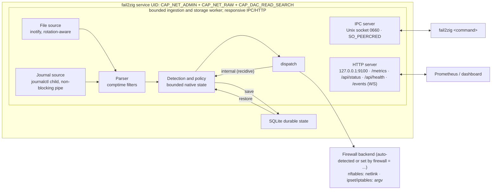

<div align="center">

# fail2zig

**A Linux intrusion prevention daemon written in Zig.**

[](https://github.com/ul0gic/fail2zig/actions/workflows/ci.yml)
[](https://scorecard.dev/viewer/?uri=github.com/ul0gic/fail2zig)
[](LICENSE)
[](https://ziglang.org/download/)
[](#installation)
[](https://github.com/ul0gic/fail2zig/releases/latest)

</div>

fail2zig is an intrusion prevention daemon inspired by fail2ban — written in Zig, as one static
executable, with a parser that cannot be made to allocate unbounded
memory by the traffic it's supposed to be stopping.

The supported migration workflow inspects fail2ban inputs, captures a read-only SQLite snapshot,
plans and validates the native projection, and performs journaled cutover/rollback. Unsupported
configuration is reported for operator action; exact fail2ban compatibility is not promised.

Version 0.4.0 consolidates
daemon and administration functions into one static executable per architecture and requires no Python or
shared SQLite library at runtime. Its [runtime architecture](docs/architecture.md) uses
statically embedded SQLite for source receipts, consumer state, protection ownership and
confirmed history. Host requirements remain explicit: journal input uses journald and
`journalctl`; the iptables and ipset backends invoke those tools with fixed arguments; nftables
talks directly to the kernel. Selected live qualification passed on Debian 13 x86_64 before the version-only change
from the unpublished 0.3.1 candidate to 0.4.0. The rebuilt artifacts passed cross-build and native/emulated command checks.
Contemporary Ubuntu may work, but is untested and is not a release gate.

---

## Table of contents

- [Quick start](#quick-start)
- [Why fail2zig](#why-fail2zig)
- [Architecture](#architecture)
- [Installation](#installation)
- [Configuration](#configuration)
- [CLI usage](#cli-usage)
- [Features](#features)
- [Project structure](#project-structure)
- [Documentation](#documentation)
- [Contributing](#contributing)
- [License & trademark](#license)

---

## Quick start

```bash
# 1. Install (downloads the static musl binary, SHA256-verifies the installed
#    release files, and installs the service, config, man pages and notices)
curl -fsSL https://github.com/ul0gic/fail2zig/raw/main/scripts/install.sh | sudo bash

# 2. (Optional) Migrate from fail2ban
sudo fail2zig --import-config /etc/fail2ban \
              --import-output /etc/fail2zig/config.toml

# 3. Validate config, then enable the service
sudo fail2zig --validate-config --config /etc/fail2zig/config.toml
sudo systemctl enable --now fail2zig

# 4. Check the daemon
sudo fail2zig status
```

One executable serves every entry point: the daemon, the administration commands,
offline `rule-test` and `migrate`. It uses compiled-in filters and needs no Python
runtime. Journald input and the ipset/iptables backends require their documented host
tools; the nftables backend talks directly to the kernel.

The installer pulls from the
[latest GitHub Release](https://github.com/ul0gic/fail2zig/releases/latest)
and verifies every asset against the published `SHA256SUMS` before placing
anything on disk. Pin a specific version with
`FAIL2ZIG_VERSION=v0.4.0` or inspect the script first with
`curl -fsSL … | less`.

---

## Why fail2zig

- **Static delivery.** One executable per supported architecture provides the daemon,
  administration commands, rule testing and migration workflows.
- **Direct nftables enforcement.** No nft userspace package is required for that
  backend. Current ipset/iptables modes invoke their tools with fixed argv, and
  journald uses journalctl. See the [runtime architecture](docs/architecture.md)
  for the delivery and dependency boundary.
- **Bounded under attack.** Native ingestion, detection, retry and administrative
  inputs have explicit record, queue, subject and memory limits. Durable receipts,
  enforcement intent and active ownership are not evicted to satisfy a ceiling.
- **Comptime-generated parsers.** Built-in filter patterns compile into
  specialized match functions at build time. There is no regex engine in the
  process. Attacker-controlled input never reaches a Turing-complete matcher.
- **Zero-copy hot path.** Parsing a log line performs no heap allocation,
  verified with `FailingAllocator` in tests. The state tracker reserves its
  full capacity at first use, so steady-state updates do not allocate either.
- **Fail closed.** If no firewall backend is usable, the daemon exits and
  logs the cause. `on_no_backend = "log-only"` is an explicit opt-in to keep
  running: bans are logged, not applied, and `status`, `/metrics`, and
  `/events` report `DEGRADED` with the cause. It is never silent.
- **fail2ban config import.** `--import-config /etc/fail2ban` translates
  `jail.conf`, its layers and selected assets into a native projection plus
  retained compatibility manifest. The report identifies settings awaiting support.

---

## Architecture


```mermaid
flowchart LR
    subgraph Daemon["fail2zig service UID: CAP_NET_ADMIN + CAP_NET_RAW + CAP_DAC_READ_SEARCH"]
        subgraph Loop["bounded ingestion and storage worker; responsive IPC/HTTP"]
            FS["File source<br/>inotify, rotation-aware"]
            JS["Journal source<br/>journalctl child, non-blocking pipe"]
            PE["Parser<br/>comptime filters"]
            ST["Detection and policy<br/>bounded native state"]
            DP["dispatch"]
            IPC["IPC server<br/>Unix socket 0660 · SO_PEERCRED"]
            HTTP["HTTP server<br/>127.0.0.1:9100 · /metrics · /api/status · /api/health · /events (WS)"]
        end
        SF["SQLite durable state"]
    end

    BE["Firewall backend (auto-detected or set by firewall = ...)<br/>nftables: netlink · ipset/iptables: argv"]
    CLI["fail2zig &lt;command&gt;"]
    PROM["Prometheus / dashboard"]

    FS --> PE
    JS --> PE
    PE --> ST
    ST --> DP
    DP --> BE
    DP -->|"internal (recidive)"| ST
    ST -->|save| SF
    SF -->|restore| ST
    IPC <--> CLI
    HTTP <--> PROM
    DP ~~~ IPC
    DP ~~~ HTTP
```

Deep-dive: [architecture/zero-dependencies](https://fail2zig.com/docs/architecture/zero-dependencies/).

---

## Installation

### Prebuilt binary (recommended)

```bash
curl -fsSL https://github.com/ul0gic/fail2zig/raw/main/scripts/install.sh | sudo bash
```

[`scripts/install.sh`](scripts/install.sh) detects the architecture and byte order, resolves the latest
release (or `FAIL2ZIG_VERSION` if set), and downloads the executable and installed
support files plus `SHA256SUMS` from the
[release](https://github.com/ul0gic/fail2zig/releases/latest) asset tree,
verifies every downloaded file that it will install, creates the `fail2zig`
system group and non-login `fail2zig` account, installs the executable to `/usr/local/bin` (removing a retired
`fail2zig-client` if one is present), installs the man pages and notices, drops
the example config at `/etc/fail2zig/config.toml` without clobbering an existing
configuration, and installs the hardened `fail2zig.service` unit under
`/etc/systemd/system/`. It does **not** auto-start the daemon — audit the config,
then run `systemctl enable --now fail2zig` when ready.

**0.4.0 release targets** (one combined daemon/admin executable each):

| Target | Hardware | Validation |
|--------|----------|------------|
| `x86_64-linux-musl` | x86_64 servers and VPSes | Full live qualification on Debian 13 |
| `aarch64-linux-musl` | ARM64 | Cross-build, static inspection and QEMU smoke |
| `arm-linux-musleabihf` | ARMv7, hard float | Cross-build, static inspection and QEMU smoke |
| `mips-linux-musleabi` | MIPS32r2, big endian, soft float | Cross-build, static inspection and QEMU smoke |
| `mipsel-linux-musleabi` | MIPS32r2, little endian, soft float | Cross-build, static inspection and QEMU smoke |

The candidate passed these validation tiers. Publication remains a separate release step.
Emulated checks do not qualify real hardware or kernel enforcement. Contemporary Ubuntu on
x86_64 may work, but is untested. Legacy firewall modes
and journal ingestion require their documented host tools.

The release allowlist is exactly:

```text
fail2zig-v0.4.0-x86_64-linux-musl
fail2zig-v0.4.0-aarch64-linux-musl
fail2zig-v0.4.0-arm-linux-musleabihf
fail2zig-v0.4.0-mips-linux-musleabi
fail2zig-v0.4.0-mipsel-linux-musleabi
fail2zig.service
fail2zig.toml.example
install.sh
fail2zig.1
fail2zig.toml.5
LICENSE
SQLITE-NOTICE.md
COPYING.date-profile
SHA256SUMS
```

### Dry-run / inspect the installer

```bash
# Inspect before piping to root
curl -fsSL https://github.com/ul0gic/fail2zig/raw/main/scripts/install.sh | less

# See what would happen without writing anything
curl -fsSL https://github.com/ul0gic/fail2zig/raw/main/scripts/install.sh | sudo bash -s -- --dry-run

# Install from a local checkout instead of downloading
sudo scripts/install.sh --local-bin zig-out/bin
```

### Manual install

If you'd rather skip the script:

```bash
# 1. Download the allowlisted release files
set -euo pipefail
VERSION=v0.4.0
ARCH=x86_64-linux-musl
BASE="https://github.com/ul0gic/fail2zig/releases/download/${VERSION}"
for file in \
  "fail2zig-${VERSION}-${ARCH}" fail2zig.service fail2zig.toml.example \
  install.sh fail2zig.1 fail2zig.toml.5 LICENSE SQLITE-NOTICE.md \
  COPYING.date-profile SHA256SUMS; do
  curl -fsSLO "${BASE}/${file}"
done

# 2. Verify each downloaded content asset (the manifest also lists other CPUs)
for file in "fail2zig-${VERSION}-${ARCH}" fail2zig.service fail2zig.toml.example \
  install.sh fail2zig.1 fail2zig.toml.5 LICENSE SQLITE-NOTICE.md COPYING.date-profile; do
  awk -v name="$file" '$2 == name { print; found++ } END { if (found != 1) exit 1 }' \
    SHA256SUMS | sha256sum --check --strict || exit 1
done

# 3. Install
sudo install -m 0755 "fail2zig-${VERSION}-${ARCH}" /usr/local/bin/fail2zig
getent group fail2zig >/dev/null || sudo groupadd --system fail2zig
sudo useradd --system --gid fail2zig --home-dir /nonexistent --no-create-home \
  --shell /usr/sbin/nologin fail2zig
```

These account commands are for a fresh installation. On an existing installation, inspect
the account and follow the [upgrade boundary](docs/operations/migration-continuity.md#upgrading-fail2zig-state).
Then follow the [systemd setup](#systemd-setup) block below.

### Build from source

Requires [Zig 0.14.1](https://ziglang.org/download/).
Zig 0.15 and later do not build this tree (ADR-012).

```bash
git clone https://github.com/ul0gic/fail2zig
cd fail2zig

# Production build (safety checks retained on parser + network paths)
zig build -Doptimize=ReleaseSafe

# The one executable lands in zig-out/bin/
ls zig-out/bin/
# fail2zig
```

### Release build target

The 0.4.0 release builds the five targets above (see
[.github/workflows/release.yml](.github/workflows/release.yml)):

```bash
make release-all
```

This produces the static release executables. Selected backends may
still require the documented host tools.

### systemd setup

If you used `scripts/install.sh`, the unit file is already in place — skip to
[Configuration](#configuration).

From a repo checkout:

Create the account as shown under manual install first. The following blocks are for a
fresh installation; preserve existing configuration and follow the upgrade instructions
for an existing database.

```bash
sudo install -m 0644 deploy/fail2zig.service /etc/systemd/system/
sudo install -d -o root -g fail2zig -m 0750 /etc/fail2zig
sudo install -o root -g fail2zig -m 0640 deploy/fail2zig.toml.example /etc/fail2zig/config.toml
sudo install -d -o fail2zig -g fail2zig -m 0750 /var/lib/fail2zig
sudo systemctl daemon-reload
sudo systemctl enable --now fail2zig
```

From the verified files downloaded in the manual-install steps above:

```bash
sudo install -m 0644 fail2zig.service /etc/systemd/system/
sudo install -d -o root -g fail2zig -m 0750 /etc/fail2zig
sudo install -o root -g fail2zig -m 0640 fail2zig.toml.example /etc/fail2zig/config.toml
sudo install -d -o fail2zig -g fail2zig -m 0750 /var/lib/fail2zig
sudo systemctl daemon-reload
sudo systemctl enable --now fail2zig
```

The shipped unit runs as the non-login `fail2zig` user and group. It uses
`ProtectSystem=strict`, `NoNewPrivileges=yes`,
`CapabilityBoundingSet=CAP_NET_ADMIN CAP_NET_RAW CAP_DAC_READ_SEARCH`,
`RuntimeDirectory=fail2zig` (auto-created on every start), no home
directories, no device nodes, no kernel tunables. `systemd-analyze security
fail2zig` can inspect the effective hardening on a specific host.

`CAP_NET_ADMIN` permits firewall operations and `CAP_DAC_READ_SEARCH` permits protected
log and journal reads. `CAP_NET_RAW` is required by the ipset backend’s iptables extension
and also grants raw IPv4/IPv6 socket authority. HTTP shares these daemon capabilities;
keep it bound to loopback. The unit excludes AF_PACKET sockets.
`FAIL2ZIG_GROUP` can select the service/monitor group during installation. Group membership
permits socket monitoring, while mutations require root or the daemon UID.

For an upgrade, stop all daemon and state writers, preserve the executable/configuration and
a coherent state backup, then run the installer and explicitly start the service. The installer
only transitions the default native SQLite parent, database and existing WAL/SHM siblings;
it refuses active writers, legacy binary state and custom state paths. It never recursively
changes ownership or starts/restarts a service. Follow the
[state upgrade instructions](docs/operations/migration-continuity.md#upgrading-fail2zig-state)
before replacing a 0.3.0 installation.

---

## Configuration

`fail2zig` reads one TOML file — `/etc/fail2zig/config.toml` by default.
The installer and the systemd setup both provide an example
there. Edit it, validate, restart.

The file must not be world-writable or writable by a non-root group; the
daemon refuses to start and prints the `chmod 0640` fix. Unknown and
duplicate keys are rejected with `file:line:col`, the key, and its section.

A minimal working config:

```toml
[global]
socket_path        = "/run/fail2zig/fail2zig.sock"
state_file         = "/var/lib/fail2zig/state.bin"
memory_ceiling_mb  = 64
metrics_enabled    = true         # false: no HTTP/WebSocket listener; IPC and the client still work
metrics_bind       = "127.0.0.1"
metrics_port       = 9100
firewall           = "auto"       # probes nftables, ipset, iptables; naming one probes only it

[defaults]
bantime    = "10m"    # integer seconds remain accepted
findtime   = "10m"    # sliding window for counting attempts
maxretry   = 5        # attempts inside findtime before a ban
banaction  = "nftables"   # nftables / iptables / ipset all mean enforce (backend comes from [global] firewall); "log-only" observes
ignoreip   = ["127.0.0.1/8", "::1"]

# bantime_increment controls how repeat offenders get longer bans.
bantime_increment_enabled     = true
bantime_increment_formula     = "exponential"
bantime_increment_multiplier  = 2
bantime_increment_max_bantime = "1w"   # cap at 7 days

[jails.sshd]
enabled = true
filter  = "sshd"
source = "journald"
# Debian 13 emits authentication records from sshd-session. Origin validation
# accepts only the root-owned executable paths explicitly listed here.
journal_executables = ["/usr/sbin/sshd", "/usr/lib/openssh/sshd-session"]

[jails.nginx-botsearch]
enabled = false            # enable only when the log exists on this host
filter  = "nginx-botsearch"
logpath = ["/var/log/nginx/access.log"]
```

After editing:

```bash
sudo fail2zig --validate-config --config /etc/fail2zig/config.toml
sudo systemctl restart fail2zig
sudo fail2zig status
```

`bantime`, `findtime`, `bantime_increment_max_bantime` and `bantime_increment_jitter`
accept integer seconds or quoted duration strings in defaults and jail overrides. Units are
`s`, `m`, `mm`, `min`, `h`, `d`, `w`, `mo`, `y`; compounds such as `"1h30m"` or
`"1h 30m"` work. Terms are nonnegative whole decimal numbers followed immediately by a
unit. Fractions, arithmetic expressions and bare TOML values such as `24h` are rejected.
Months and years mean fixed 2,629,800 and 31,557,600 seconds. Existing field limits apply;
zero is allowed for jitter but not bantime, findtime or the escalation cap. `"permanent"`
is available only for `bantime`. CLI durations and timeouts keep their existing numeric syntax.

Full schema: [fail2zig.toml(5)](docs/man/fail2zig.toml.5).

### Migrate from fail2ban

```bash
fail2zig --import-config /etc/fail2ban \
         --import-output /etc/fail2zig/config.toml
```

Configuration import order is `jail.conf` → sorted
`jail.d/*.conf` → `jail.local` → sorted `jail.d/*.local`, including ordered
before/after includes. The importer retains raw settings, parameterized assets and
provenance in a protected manifest alongside the native configuration projection.

The supported workflow inspects the source, captures a read-only SQLite snapshot, creates and
validates a deterministic plan, and then performs a journaled cutover. Unsupported enabled
protection, custom executable actions, changed input and unsafe continuity block activation
before mutation. Imported regexes are not automatically executed or silently replaced by a
same-named built-in filter.

Step-by-step guide: [guides/migration-from-fail2ban](https://fail2zig.com/docs/guides/migration-from-fail2ban/).

The journaled cutover and rollback (`fail2zig migrate inspect|snapshot|plan|validate|cutover|status|rollback`)
and the mapping of every `fail2ban-client` invocation to its native command, exit class
and JSON schema are in
[docs/operations/command-migration.md](docs/operations/command-migration.md).

---

## CLI usage

One executable, three modes. Full reference: [docs/man/fail2zig.1](docs/man/fail2zig.1);
script migration: [docs/operations/command-migration.md](docs/operations/command-migration.md).

### Daemon — `fail2zig [daemon]`

```
fail2zig [OPTIONS]

OPTIONS:
  --config <path>           Config file (default: /etc/fail2zig/config.toml)
  --foreground              Run in foreground (only mode)
  --validate-config         Load and validate config, exit (--test-config is an alias)
  --import-config [<dir>]   Import fail2ban config (default: /etc/fail2ban)
  --import-output <path>    Output path for imported config
  --version, -V             Print version and exit
  --help, -h                Print help and exit
```

Under systemd the unit is `Type=notify`: `READY=1` is sent only after configuration,
storage, every source and enforcing protection are admitted; `RELOADING=1`/`READY=1`
bracket a live reload (`ExecReload` sends `SIGHUP`); `STOPPING=1` precedes exit;
`SIGUSR1` reopens `global.log_target`. No socket unit ships.

### Administration — `fail2zig <command>`

| Command | Description |
|---------|-------------|
| `status` | Protection state (`active` / `log-only` / `mixed` / `DEGRADED (<cause>)`), backend, storage phase, generation, active and total bans |
| `jails` | Configured jails: enabled, paused, health, thresholds, action, source |
| `list [--jail <name>]` | Active bans |
| `ban <ip> --jail <name> [--duration <s>] [--scope host\|net <cidr>]` | Manual ban (exactly one jail; `net` needs nftables or ipset) |
| `unban <ip> --jail <name> [--scope host\|net <cidr>]` | Release a ban |
| `reload` | Propose the configuration file as a new generation: `noop`, `applied`, `rejected` or `restart_required` |
| `history [--jail <name>] [--limit <n>] [--cursor <token>]` | Page through confirmed ban history |
| `history reset <ip> (--jail <name> \| --all)` | Reset an address's durable history |
| `jail enable\|disable\|pause\|resume <name>` | Administer one jail |
| `config` | Effective configuration and generation (redacted for non-administrators) |
| `version` | Daemon version over the socket |
| `completions <bash\|zsh\|fish>` | Shell completion script |
| `help [command]` | Help |

Global flags: `--socket <path>`, `--output table|json|plain`, `--no-color`,
`--timeout <ms>`. Members of the `fail2zig` group may run the read-only commands
through the 0660 socket; mutations require uid 0 or the daemon uid.

Exit classes (every command): `0` success · `1` rejected or absent · `2` usage ·
`3` daemon unavailable · `4` partial (kernel confirmation incomplete) · `5` uncertain.

### Offline — `fail2zig rule-test` and `fail2zig migrate`

```bash
# Evaluate a log against a compiled service or a native rule file; no daemon needed.
fail2zig rule-test --file /var/log/auth.log --service sshd --tz-offset 0 --output table
fail2zig rule-test --record 'Denied login for x from 203.0.113.9 port 2201' --rule-file rule.json

# Read-only migration preparation, then the journaled cutover.
fail2zig migrate inspect --source-dir /etc/fail2ban
```

`rule-test` samples carry the extracted identity and reason, never the raw line unless
`--print-lines` is given. Exit `0` processed, `1` refused, `2` usage.

---

## Features

### Parser engine

Comptime DSL compiles pattern definitions into specialized `MatchFn` functions
at build time. `<IP>`, `<HOST>`, `<TIMESTAMP>`, and `<*>` tokens produce
zero-alloc parse paths. A multi-pattern `Matcher` adds min-length and
first-byte early-exit probes. The parser is verified zero-alloc via
`FailingAllocator`; the state tracker reserves its capacity at first use.

### Firewall backends

| Backend | Implementation | Notes |
|---------|----------------|-------|
| nftables | netlink, no shell-out (`engine/firewall/nftables.zig`) | Preferred on modern kernels |
| iptables | argv subprocess (`engine/firewall/iptables.zig`) | Legacy fallback |
| ipset | argv subprocess (`engine/firewall/ipset.zig`) | High-cardinality ban lists |

`[global] firewall` selects the backend. `"auto"` (the default) probes
nftables, then ipset, then iptables, and uses the first that is usable.
`"nftables"`, `"ipset"`, or `"iptables"` probes only that backend. If it is
unusable, `on_no_backend` decides: `"fail-closed"` (the default) exits with
the cause logged; `"log-only"` runs DEGRADED, shown as
`Protection: DEGRADED (<cause>)` by `fail2zig status` and in
`/api/status`. There is no fallback to another backend.

`banaction` does not select a backend. Its values `nftables`, `iptables`,
and `ipset` are accepted for fail2ban compatibility and all mean enforce
with the selected backend; `log-only` observes.

eBPF/XDP (NIC-level drop) is on the roadmap; it is not scheduled.

### Ban lifecycle

- Per-IP 128-slot ring buffer of attempt timestamps for sliding `findtime` windows
- Linear and exponential `bantime_increment`, capped at `bantime_increment_max_bantime`
- CIDR-based ignore list (IPv4 `/0`–`/32`, IPv6 `/0`–`/128`); ignored IPs
  short-circuit before any state update
- Bounded native tracking that retains protection-critical receipts, retry
  state, enforcement intent and active ownership at capacity
- Embedded SQLite transactions for records, source progress, retry state,
  decisions and effect intent; confirmed kernel state is reconciled on restart

The configured state directory must already exist and be writable inside the daemon's service
environment. The shipped systemd unit provides `/var/lib/fail2zig`; custom paths must also satisfy
its filesystem restrictions. The daemon refuses startup before firewall mutation or log
ingestion when required persistence cannot be opened or validated. Runtime storage failures pause
affected ingestion while protection and bounded degraded-health reporting remain available.

### IPC & metrics

- Unix domain socket at `/run/fail2zig/fail2zig.sock` — mode 0660,
  `SO_PEERCRED` authentication, length-prefixed binary protocol, 8 concurrent
  clients, 1 MiB frame cap
- HTTP on `127.0.0.1:9100` — `GET /metrics` (Prometheus), `GET /api/status`
  (JSON), `GET /api/health` (readiness components: config, storage, sources,
  clock, enforcement, admin; 200 when ready, 503 otherwise), `GET /events` (WebSocket, RFC 6455; broadcasts
  `attack_detected`, `ip_banned`, `ip_unbanned`, `metrics`; max 16 clients)
- `metrics_enabled = false` binds no HTTP listener; the socket and the
  administration commands are unaffected. `metrics_port = 0` is rejected, it does
  not disable the endpoint

### Built-in filters (15)

| Category | Filters |
|----------|---------|
| SSH | `sshd` (9 patterns: authentication failures, invalid users, PAM failures and selected protocol errors) |
| Web | `nginx-http-auth`, `nginx-limit-req`, `nginx-botsearch`, `apache-auth`, `apache-badbots`, `apache-overflows` |
| Mail | `postfix`, `dovecot`, `courier` |
| DNS | `named-refused` (BIND) |
| FTP | `vsftpd`, `proftpd` |
| Database | `mysqld-auth` |
| Meta | `recidive` (escalates repeat offenders — fed in-process from confirmed bans in other jails, `source = "internal"`; no ban log to tail) |

Full reference: [reference/filters](https://fail2zig.com/docs/reference/filters/).
Filter names accept hyphenated or underscore forms
(`nginx-http-auth` ≡ `nginx_http_auth`).

---

## Compatibility and operational limits

fail2zig supports built-in filters, per-jail thresholds, ignore lists, escalating
bans, persistence, and nftables/iptables/ipset enforcement. The native format is
TOML; `--import-config` translates supported fail2ban settings and disables
unsupported custom filters with a warning. Review the generated configuration, especially increment formulas and caps: native
escalation settings do not guarantee identical fail2ban semantics.

Compatibility is not complete: runtime custom regex/action scripts and runtime
`set` of thresholds are not implemented by design. `fail2zig reload` applies
`maxretry`, `bantime`, `bantime_kind`, `bantime_increment`, `log_level` and a custom
jail's `ignore_file` live; every other key is reported as `restart_required`.
`maxretry` supports 1–128.
The memory setting sizes bounded tracked state, not every daemon allocation.

Manual bans honor jail defaults, appear in listings/status, and persist. An
address shared by multiple jails stays blocked until its final owner expires or
is removed. Repeating a manual ban extends its expiry without counting a new ban.
iptables and ipset expiry is daemon-managed: their entries remain while the daemon
is stopped, and expiry resumes on restart. nftables also uses kernel timeouts.

The filter regression corpus is in `tests/integration/filter_corpus.json`.
It contains synthetic cases, not a production-log compatibility certification.

Firewall effects are bound to the daemon's current network namespace. The built-in selector uses
that namespace directly; the daemon does not enter a different namespace. Custom namespace
selectors or service overrides that move the daemon between network namespaces are not supported
in 0.4.0.

---

## Project structure

```
fail2zig/
├── engine/              # Daemon (runs as root)
│   ├── core/            # Event loop, log watcher, parser, state tracker
│   ├── firewall/        # nftables (netlink), iptables, ipset backends
│   ├── config/          # Native TOML + fail2ban jail.conf importer
│   ├── filters/         # Comptime-generated filter library (15 filters)
│   ├── net/             # HTTP metrics + WebSocket event server
│   └── main.zig         # Entry point, CLI args, daemon lifecycle
├── client/              # Administration modules linked into the one executable
├── shared/              # Common types (IPC protocol, IP addresses)
├── tests/               # See tests/README.md for the layout
│   ├── integration/     # Zig integration tests
│   ├── benchmark/       # Zig microbenchmarks (-Dbench=true)
│   ├── fuzz/            # Zig fuzz corpora (parsers, protocol, config)
│   ├── harness/         # Shell-based system harness (lab-box tests)
│   └── e2e/             # Deploy-regression scripts (real install + shipped unit)
├── docs/                # Installable man pages
│   ├── architecture.md  # Runtime, durability and dependency boundaries
│   ├── man/             # troff: fail2zig(1), fail2zig.toml(5)
│   └── operations/      # Operator runbooks (command migration, continuity)
├── deploy/              # systemd unit, example config
├── scripts/             # Public installer (scripts/install.sh)
├── .github/workflows/   # CI (ci.yml) + release pipeline (release.yml)
├── build.zig            # Builds the one executable
└── build.zig.zon        # Zig package manifest
```

---

## Documentation

| Kind | Where | What |
|------|-------|------|
| Architecture | [docs/architecture.md](docs/architecture.md) | Runtime, durability and dependency boundaries |
| Guides | [fail2zig.com/docs](https://fail2zig.com/docs/) | Task-oriented walkthroughs (migration from fail2ban) |
| Reference | [fail2zig.com/docs](https://fail2zig.com/docs/) | Config schema, CLI flags, filter catalogue |
| Man pages | [docs/man/](docs/man/) | `fail2zig(1)`, `fail2zig.toml(5)` |
| Operations | [docs/operations/](docs/operations/) | Command migration from fail2ban-client, continuity boundary |
| Tests | [tests/README.md](tests/README.md) | Unit / integration / benchmark / fuzz / harness layout |

---

## Contributing

fail2zig wants to be a modern alternative to fail2ban — a native
tool that understands the services people actually run in 2026.
Contributors are how it gets there. The codebase is small (~29K lines of
Zig, ~32K with `tests/`), the conventions are boring on purpose, and the contribution surface
is wide open.

### The biggest ask: modern filters

fail2ban's built-in filter library largely stopped expanding around 2015.
The internet moved on. The highest-leverage contribution right now is
**a pattern file for a service you actually run**. Candidates we'd love
to ship:

- **Container + orchestration** — Docker daemon events, Kubernetes API auth, Nomad, container runtime audit logs
- **Reverse proxies** — Traefik, Caddy, Envoy, HAProxy
- **Self-hosted services** — Vaultwarden, Authelia, Keycloak, Gitea, Forgejo, Jellyfin, Immich, Nextcloud, Jenkins
- **LLM endpoints** — Ollama, OpenWebUI, LocalAI — a whole category that post-dates fail2ban
- **Databases** — PostgreSQL, Redis, MongoDB auth failures
- **Observability** — Grafana, Prometheus unauthorized access

Each filter is a handful of log-line patterns plus a few test cases.
`engine/filters/sshd.zig` is the cleanest reference for the shape. Bring
real log lines from a real deployment if you can — that's the gold
standard.

Not a Zig developer? Good filter proposals are welcome as issues too — a
few representative log lines + the name of the service is enough to open
the door.

### Good first contributions

- **Add a filter** for any service listed above (or one that isn't).
- **Improve fail2ban migration output** — if `--import-config` skipped or mistranslated a jail you use, open an issue with the original `jail.conf` stanza.
- **Fix a doc rough edge** — typos, unclear wording, missing context in a `.md` file.
- **Add a test case** to an existing filter that covers an edge case.
- **Benchmark fail2zig on a platform** we don't test and share numbers.
- **Bug report from real deployment** — what broke, what you'd expect.

### Pick your path

| You want to... | Path |
|---|---|
| **Report a security vulnerability** | [GitHub Private Security Advisories](https://github.com/ul0gic/fail2zig/security/advisories/new) — not a public issue. Ack in 48 h, coordinated disclosure. See [SECURITY.md](SECURITY.md). |
| **Report a bug** | [Open an issue](https://github.com/ul0gic/fail2zig/issues/new). Include Zig version (`zig version`), OS (`uname -a`), and a minimal config that reproduces it. |
| **Add a filter for a modern service** | PR directly. Include positive + negative test cases and real log lines if you have them. |
| **Fix a typo, doc, or small bug** | PR directly. No issue needed. |
| **Propose a feature** | Open an issue to sketch the shape — saves you building something that won't fit. |
| **Contribute a larger change** | Issue first so we can align, then PR. Keep PRs single-purpose. |

### Licensing

By opening a pull request, you agree your contribution is licensed
**AGPL-3.0-or-later** — the same license as the rest of the project. No
CLA, no sign-off ceremony. `git blame` is the authorship record.

Trademark on the "fail2zig" name and logo is separate and not granted by
contributing — see [Trademark](#trademark) below.

### Development setup

```bash
git clone https://github.com/ul0gic/fail2zig
cd fail2zig
zig build -Doptimize=ReleaseSafe
zig build test-native-foundations -Doptimize=ReleaseSafe
```

**Requires:**

- [Zig 0.14.1](https://ziglang.org/download/); Zig 0.15 and later do not build this tree (ADR-012).

Product builds, installation, runtime and maintained product-test paths require no Python or
shared SQLite library. `test-standalone-surface` checks the repository and built executable for
forbidden interpreter and shared-runtime dependencies; `test-release-local` assembles the bounded
local release checks.

The marketing site (fail2zig.com) lives in a separate repo and is not covered here.

### Standards

CI enforces these — not because we're precious, because they catch real
bugs early and keep the binary small.

**Zig:**
- `zig fmt engine/ client/ shared/ tests/` before every commit — CI-enforced
- `zig build` and the smallest affected registered test root pass with zero failures/leaks;
  the bounded release-local composition runs once after converged release changes
- Zero compiler warnings; `zig build -Doptimize=ReleaseSafe` clean
- No `@panic` in production code — propagate errors explicitly
- No `@setRuntimeSafety(false)` without a comment proving the safety invariant
- All tests use `std.testing.allocator` for leak detection
- SPDX header on every `.zig` file (CI-enforced)

### A good PR

- **One purpose per PR.** A bug fix is not a refactor + rename + unrelated cleanup. If the description wants to say "also," split it.
- **Commit messages follow existing style:** `feat(scope): …`, `fix(scope): …`, `docs(scope): …`, `chore(scope): …`. Scope is the directory or module.
- **Description explains *why*.** The diff already shows *what*. If it fixes a bug, link the issue.
- **Tests.** A bug fix includes a regression test that would have failed before the fix. A feature covers the happy path plus at least one error case. Filter contributions include positive + negative log lines.
- **CI green.** If CI is broken on `main`, that's its own PR first.

A PR that hits those marks gets reviewed. Feedback is aimed at landing
the change, not gatekeeping — if something needs adjusting, we'll say
what and why.

### Things we're intentionally not building

Open an issue if you want to argue for any of these — the list is not
immutable, just what we've decided against so far:

- **Windows or macOS support** — Linux-only until v1.0.
- **GUI dashboards inside the daemon** — the `/events` WebSocket is the extension point. Dashboards live outside the daemon.
- **Plugin systems or embedded scripting in the core** — see [architecture/zero-dependencies](https://fail2zig.com/docs/architecture/zero-dependencies/) for the reasoning.
- **SIEM-specific adapters** — fail2zig emits Prometheus metrics + structured JSON; SIEM vendors handle ingestion on their side.
- **Shell-script ban actions** — no `action.d`-style scripts, no `/bin/sh`. nftables is programmed over netlink; the ipset/iptables backends exec a fixed argv when selected.

### Useful Makefile targets

```bash
make build          # Debug build
make test           # zig build test
make bench          # Microbenchmarks
make fuzz           # Fuzz corpus run
make release        # ReleaseSafe native build
make lint           # zig fmt --check, shellcheck, yamllint
make harness-smoke  # Lab-box attack smoke test (requires a Linux host)
```

Run a single test or filter by substring:

```bash
zig build test -Dtest-filter=parser
```

### Review + communication

Everything lives on the repo — issues, PRs, and security advisories.
Keeping it there means the project history is public and searchable; new
contributors can read what was decided and why without joining a chat.

Review timing is best-effort. Small PRs usually get a first look within a
few days; larger ones longer. Security advisories are acknowledged within
48 hours. A gentle ping on a PR untouched for two weeks is welcome.

---

## License

fail2zig is licensed under the **GNU Affero General Public License v3.0 or
later** (AGPL-3.0-or-later). See [LICENSE](LICENSE) for the full text.

In plain terms:

- You can run, read, fork, modify, and redistribute fail2zig.
- If you modify it, your modifications are also AGPL-3.0-or-later and must be
  published on request — including when you only expose the software over a
  network (the "network use is distribution" clause is the whole point of
  AGPL).
- Internal commercial use is fine. Self-hosting is fine. Forking for your
  own needs is fine. Publishing a fork under a different name is fine.

The AGPL covers **code rights**. Brand, name, and identity are separate — see
Trademark below.

## Trademark

"fail2zig", the fail2zig wordmark, and the fail2zig logo are trademarks of
the project maintainer. Trademark rights are asserted immediately (™) and
registration is planned.

You may fork and modify the code under the AGPL-3.0-or-later. You may **not**:

- use the "fail2zig" name, wordmark, or logo for a derived, modified, or
  repackaged distribution;
- imply your fork is the official project, endorsed by the maintainer, or
  affiliated with fail2zig;
- use the name or branding for a commercial hosted service offering.

If you ship a fork, give it a different name. This separation — permissive
code rights, strict name rights — is the same model used by Redis
(pre-2024), Elasticsearch, and Grafana Labs. Contact the maintainer for any
trademark licensing question.
