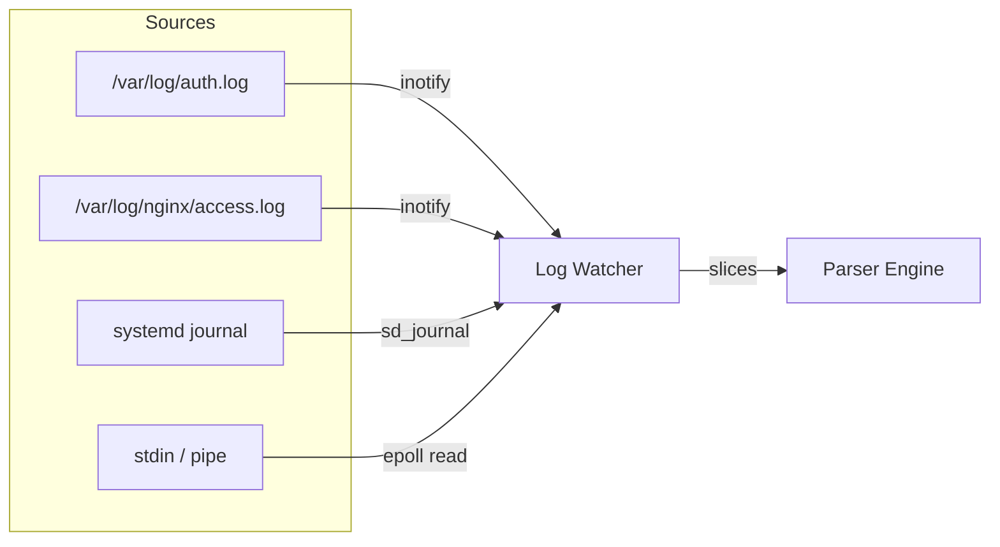

# Log Watching

> The component that turns "something happened on this system" into bytes
> a parser can read. Correctness under rotation, truncation, and burst
> load is non-negotiable.

## The claim

fail2zig follows every log source it's configured for without dropping
events, without double-reading after rotation, and without polling the
filesystem. It does this using the lowest-level kernel primitives each
platform offers: inotify on Linux, kqueue on BSD, sd_journal for the
systemd journal, and io_uring for batched reads where available.

All sources feed the same event loop. Parser functions don't care which
watcher found the bytes; they all arrive as slices through the same
interface.

## The topology



Every source produces the same output: a slice of bytes representing
one log line. The watcher is the abstraction layer that hides the
platform mechanism from the rest of the daemon.

## File-based sources on Linux

The primary Linux mechanism is **inotify**. fail2zig watches each
configured log file with `IN_MODIFY | IN_CREATE | IN_MOVE_SELF |
IN_DELETE_SELF`. The event loop integrates inotify's file descriptor
into epoll alongside every other fd fail2zig cares about — the IPC
socket, the timer fd, signalfd, the metrics HTTP listener.

When `IN_MODIFY` fires, the watcher reads forward from the file's
current offset until it hits EOF. Lines are split on `\n` and handed
to the parser one at a time. The offset is persisted in the watcher's
per-file state so restarts resume where they left off.

### Rotation

Rotation is the source of most bugs in log-following code, and every
production log watcher has a rotation test suite in its history. The
cases we handle:

| Event | What happened | What the watcher does |
| --- | --- | --- |
| `IN_MOVE_SELF` | `mv auth.log auth.log.1` | Drain remaining bytes from the old fd, close it, watch for `IN_CREATE` on the parent directory. |
| `IN_DELETE_SELF` | `rm auth.log` | Same as move — drain + close + re-watch. |
| `IN_CREATE` on parent dir for a watched filename | A new file was created where we expect | Open the new file, start watching its fd, rewind to offset 0 (new inode). |
| File truncated in place | `> auth.log` inside the open fd | Detect via `fstat` — new size < last known offset — reset offset to 0 and resume. |
| Log-rotate with copy-truncate | The file gets copied aside and then truncated in place | Handled by the truncation case above. |
| Log-rotate with create | Standard case. The old file gets renamed and a new one appears. | Handled by the move + create sequence. |

The watcher's rotation tests are in `tests/integration/log_rotation.zig`.
They are parameterised over the five real-world rotation modes operators
actually deploy (logrotate with `copytruncate`, logrotate with `create`,
syslog-ng's internal rotation, the journal's binary rotation, and `mv`
+ SIGHUP).

### Why not tail-follow the whole file

An alternative design would be to `tail -f`-style hold every log file
open and do blocking reads. We rejected that for fail2zig because:

- **Blocking reads don't integrate with epoll.** We'd need either a
  thread per log file, or a hybrid polling approach. Neither composes
  cleanly with the single-threaded event loop we have.
- **Missed events during rotation.** `tail -f` famously misses bytes
  between rotation and file recreation. The inotify-driven approach
  handles that with explicit event ordering.
- **File descriptor pressure.** Watching 50 log sources with `tail -f`
  means 50 open fds; inotify gives you 50 watches with one fd.

inotify is the right abstraction for this problem. The kernel already
solves the "notify me when files change" problem correctly; we just
use that.

## The systemd journal

The journal is a different beast. It is not a text file; it's a
structured binary store with its own query interface
(`sd_journal_next`, `sd_journal_get_data`). fail2zig reads it via
**sd_journal through narrow C interop**.

The journal-watching path is:

1. Open the journal with `sd_journal_open`.
2. Add a match filter — we subscribe to specific `SYSLOG_IDENTIFIER`
   values (sshd, postfix, etc.) based on enabled filters. The journal
   pre-filters for us in the kernel; we don't read every record.
3. Seek to the tail (`sd_journal_seek_tail`), then forward one entry
   so the next `sd_journal_next` yields the first new record.
4. Integrate the journal's fd (`sd_journal_get_fd`) into the epoll set.
5. When the fd is ready, loop `sd_journal_next` until it returns 0,
   extracting the `MESSAGE` and any relevant structured fields for
   each record.

Every `sd_journal_*` call is checked. A non-zero return is an error,
surfaced as a typed Zig error. The C-interop wrapper is ~120 lines of
Zig in `engine/core/log_watcher/journal.zig` — small enough to audit in
a coffee break.

### Why we use sd_journal

The journal is the authoritative source of structured events on
systemd-managed hosts. It knows the unit name, the PID, the UID, and
the message without us having to parse a timestamp or a syslog
prefix. For services like sshd that log via systemd, reading the
journal is more accurate *and* faster than tailing `/var/log/auth.log`.

The C interop is a trade-off we accept because sd_journal's wire format
— the on-disk journal file layout — is explicitly *not* a stable ABI.
The C library is the stable interface. Writing our own journal reader
would mean chasing every format change libsystemd makes.

## io_uring for high-throughput sources

On Linux kernels ≥ 5.1, fail2zig uses **io_uring** for log reads when
available. This matters for two cases:

1. **Very busy single files.** An nginx access log on a high-traffic
   server easily hits 10,000+ lines per second. Each inotify `IN_MODIFY`
   triggers a `read` syscall. At that rate the syscall cost starts
   mattering.
2. **Many simultaneous sources.** Watching 50+ log files (shared
   hosting, large service meshes) multiplies the syscall pressure
   linearly.

io_uring lets us submit batched read requests and harvest results in
bulk. A single `io_uring_enter` can submit 64 read operations and
collect their completions — roughly a 30x reduction in syscall count
under load compared to one `read` per event.

The io_uring path is behind a feature detection at startup. On kernels
< 5.1 or environments where io_uring is unavailable (some container
runtimes disable it), we fall back transparently to read-per-event on
epoll. Filters don't care; they get bytes either way.

### Security note on io_uring

io_uring has had a rough security history — several kernel
vulnerabilities in the last two years. fail2zig opens its ring with
`IORING_SETUP_DEFER_TASKRUN | IORING_SETUP_SINGLE_ISSUER` (the most
restricted mode) and submits only `IORING_OP_READ` operations with
pre-validated fds. We do not use io_uring's fancier operations
(accept, connect, splice) — we want only the performance benefit of
batched reads, not the broader surface.

Operators who prefer not to use io_uring can disable it with
`log.io_uring = false` in `fail2zig.toml`. The epoll path is the
default behaviour on kernels < 5.1 anyway; forcing it off on newer
kernels trades throughput for a narrower syscall surface.

## stdin mode

For testing and pipe-based integration, fail2zig can read log bytes
from stdin: `fail2zig --stdin-source=sshd`. Every line on stdin is
treated as a log line with the given tag. This mode is indispensable
for CI — you can pipe an attack replay into the daemon and assert on
the resulting ban decisions.

It's also useful for weird log sources that don't live in files or
the journal. If you can get bytes to a pipe, fail2zig can consume
them.

## Back-pressure

The event loop reads from all watchers in a single pass per iteration.
If the parser is slower than the log sources, the watcher's read
buffer fills up. inotify will coalesce `IN_MODIFY` events while the
file grows, so we don't lose the *signal* that new data exists — when
the parser catches up, the watcher reads everything in one go.

For io_uring, completions queue up in the completion ring. The ring
size is configurable (default 1024). If the ring fills faster than we
drain, submissions block at the `io_uring_enter` call — the kernel
applies the back-pressure to us, not the other way around.

There is no unbounded buffering anywhere in the watcher. Every buffer
has a known maximum size. If we fall behind so far that a buffer
overflows, we drop events with a counter increment and a log message.
Silent loss is never the behaviour.

## How to verify

```bash
# Is fail2zig using inotify or io_uring?
$ fail2zig-client stats | grep -i log
log.watcher.mode: io_uring
log.watcher.sources: 5 files + journal

# Watch the rotation tests run:
$ zig build test -Dtest-filter=log_rotation

# Manually rotate a log and confirm events aren't missed:
$ echo "Failed password for invalid user test from 10.0.0.1 port 22" >> /var/log/auth.log
$ mv /var/log/auth.log /var/log/auth.log.1
$ touch /var/log/auth.log
$ echo "Failed password for invalid user test from 10.0.0.1 port 22" >> /var/log/auth.log
$ fail2zig-client stats | grep -i lines
lines.processed: 2
lines.dropped: 0
```

Two lines in, two lines processed, nothing dropped — even with a
rotation between them.

## Related reading

- [Parser engine](/docs/architecture/parser-engine) — what happens to
  log lines after the watcher
- [Zero runtime dependencies](/docs/architecture/zero-dependencies) —
  why we use sd_journal via narrow C interop instead of parsing journal
  file format
- [Configuration reference](/docs/reference/config) — `log.sources`,
  `log.io_uring`, `log.max_line_length`
