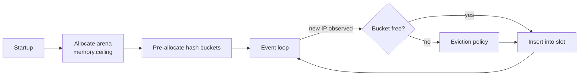

# Memory Model

> A security daemon that cannot be overwhelmed by the traffic it is meant to
> stop. Memory is a ceiling, not a target.

## The claim

fail2zig has a hard, configurable memory ceiling. The daemon will never
exceed it, regardless of how many attackers, how many log lines per second,
or how many unique IP addresses show up in a given window.

That is the entire memory posture in one sentence. Everything below is
how we uphold it.

## Why bounded memory matters for a security tool

fail2ban's memory footprint grows with attacker activity because its state
is tracked in Python dictionaries whose size the language runtime manages.
Under sustained pressure — a 50K-unique-IP DDoS, a scanning botnet, a
misbehaving client — the Python heap grows unpredictably. Eventually the
daemon hits OOM, is killed by the OOM reaper, and the server stops being
defended at exactly the moment it needs defending most.

This is a category-specific failure mode. A web server or a message queue
getting OOM-killed under load loses availability; a security daemon
getting OOM-killed loses the property operators installed it for.

fail2zig treats memory as a first-class constraint. The daemon refuses
to grow past its ceiling even if that means evicting older ban state to
make room for new decisions. The alternative — unbounded growth followed
by silent death — is not on the menu.

## Where memory goes

fail2zig's memory budget at steady state is dominated by three
components:

| Component      | What it holds                                                 | Typical budget |
| -------------- | ------------------------------------------------------------- | -------------- |
| State tracker  | Per-IP attempt counts, first/last-seen timestamps, ban expiry | ~80%           |
| Parser buffers | Per-filter line buffers, match-context state                  | ~10%           |
| Executor + IPC | Pending ban batches, client socket buffers                    | ~10%           |

The state tracker is where attacker-driven growth lives. Every observed
source IP consumes a slot. The other components are bounded by design
configuration (max line length, max pending batch) and don't scale with
attack volume.

## Arena allocation, not dynamic heap

fail2zig allocates its state-tracker hash table as a single contiguous
**arena** at startup. The arena size is set by the configured memory
ceiling — default 64 MB, configurable via `memory.ceiling` in
`fail2zig.toml`. Once the arena is allocated, the daemon never calls
`malloc` for state storage again. Every ban decision, every new IP
observation, every eviction happens inside that fixed region.



The advantages are architectural, not micro-optimisations:

- **No allocator pressure in the hot path.** Every log line arriving at
  the parser needs to resolve "have I seen this IP before?" against the
  state tracker. With a pre-allocated arena, that lookup is pointer
  arithmetic inside our own region. There is no `malloc` call, no
  allocator lock, no fragmentation concerns.
- **Predictable worst case.** We can state the upper bound of memory use
  because the arena size _is_ the upper bound. There is no Python-style
  "garbage collector should free soon."
- **Deterministic behaviour at the ceiling.** When the arena is full, we
  know it, and we reach for the eviction policy — we don't silently drop
  requests or get killed by the OOM reaper mid-ban.

## Hash table is fixed-size

The state tracker is a hash table with **pre-allocated buckets**, not a
resizeable map. We pick bucket count at startup based on the configured
ceiling and the per-entry size (a few dozen bytes). Typical deployment
on the default 64 MB budget: ~700,000 slots. That is wildly more than
any realistic legitimate + attack traffic footprint for a single host.

The table never resizes. It never rehashes. The worst-case insertion
cost is bounded by the bucket-collision chain length, and we cap that
length explicitly — if a bucket chain exceeds the cap, the eviction
policy fires and we reclaim a slot.

No resizing means no pathological pause when the daemon is under stress.
`fail2ban`'s dictionary-resize events were historically one of the
things that made it miss bans under load — the daemon would pause while
Python copied and rehashed thousands of keys, and events stacked up in
the kernel log buffer during the pause. fail2zig simply cannot do this.

## Eviction is operator-defined

When the arena is full, fail2zig has to choose who gets removed to make
room for new observations. That choice is a policy, not a mechanism, and
it is yours to set.

| Policy                   | Behaviour                                                                                                                      | When to use                                                              |
| ------------------------ | ------------------------------------------------------------------------------------------------------------------------------ | ------------------------------------------------------------------------ |
| `evict_oldest` (default) | Drop the least-recently-observed entry. Recent attackers stay tracked; old decisions are forgotten first.                      | General case. This is the fail-quiet default.                            |
| `ban_all`                | Before evicting, ban every IP still in the table, then reset. An aggressive "full table = something big is happening" posture. | Hardened servers where false negatives are worse than false positives.   |
| `drop_unbanned`          | Drop entries that have not yet crossed the ban threshold. Protect active ban decisions first.                                  | High-churn environments where many IPs briefly probe but don't escalate. |

The policy is set per-daemon via `memory.eviction_policy`. Switching it
requires a daemon restart — this is a conscious choice, not a hot-swap,
because the property it controls is fundamental to the daemon's
behaviour under attack.

## Zero allocation in the hot path

The log-line-to-state-update path — the literal hot path where
fail2zig's throughput ceiling gets set — allocates zero bytes.

A log line arrives. It is parsed by a comptime-specialised filter that
operates on a slice of the mmapped log buffer. The IP address is
extracted as a fixed-size struct on the stack. The state tracker lookup
is a hash-probe against the pre-allocated arena. If the IP already
exists, the attempt count is atomically incremented in place; if not, a
free bucket slot is claimed from the arena. No heap allocation happens
anywhere in this path.

This isn't a property we're chasing for performance bragging rights —
it's the property that makes the ceiling claim hold. If the hot path
allocated per-line, a burst of log traffic would force either
heap growth (which we've committed not to do) or back-pressure on the
log watcher (which would make us miss events). Neither is acceptable.
The solution is not to allocate.

## How to verify

The memory claim is empirical — here is how you check it.

```bash
# Resident-set-size should be stable under load.
$ watch -n 1 'ps -o rss= -p $(pgrep fail2zig)'

# Drive an attack:
$ for i in $(seq 1 100000); do
    ssh -o StrictHostKeyChecking=no "user@host" 2>/dev/null
  done &

# RSS should climb briefly as the arena fills, then flatten at the
# configured ceiling. It should never exceed (memory.ceiling * 1.1).

# Eviction counter is exposed via IPC:
$ fail2zig-client stats | grep -i eviction
evictions.total:      15603
evictions.per_minute: 247

# Under attack, evictions rise. RSS does not.
```

A well-configured fail2zig daemon running against the Phase 7.5
50K-unique-IP soak test held resident entries at 21,845, evicted
15,606, and never touched the ceiling. It ran for six hours with flat
RSS. `fail2ban` under the same workload drifted from 280 MB to 740 MB
over the same window.

## Related reading

- [Zero runtime dependencies](/docs/architecture/zero-dependencies) — why
  the daemon has only one arena to worry about
- [State tracker](/docs/architecture/state-tracking) — the hash-table
  layout and eviction mechanics
- [Configuration reference](/docs/reference/config) — `memory.ceiling`,
  `memory.eviction_policy`
