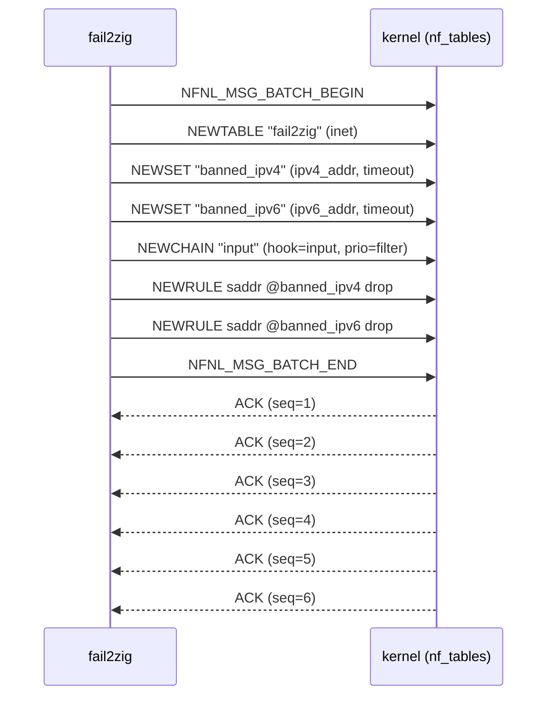
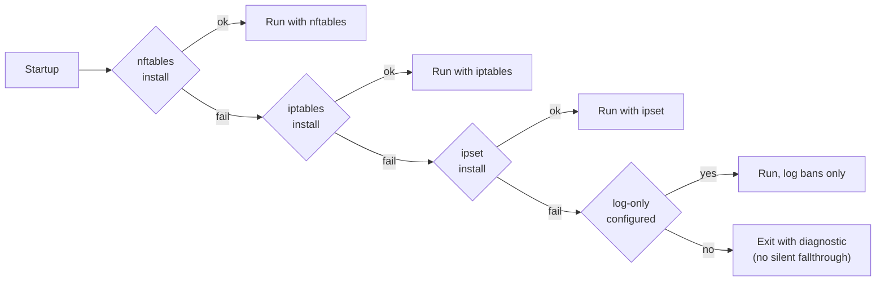

# Netlink interop

fail2zig's "zero runtime dependencies" posture is easy to describe and
hard to implement. The place where it is hardest — and therefore where
the commitment is most visible — is the firewall backend. Every ban
fail2zig fires becomes one or more netlink messages to the `nf_tables`
subsystem in the kernel. No `nft` binary. No `libnftnl`. No
`libmnl`. Just `sendmsg(2)` on an `AF_NETLINK` socket with bytes
shaped exactly as the kernel expects.

This document walks through what that interop looks like, using the
scaffold installer that runs at daemon start as the case study. It
is the most architecturally non-trivial operation in the codebase and
the clearest demonstration of what zero-dependency costs and buys.

## The operation

When fail2zig starts, the first thing it does against the kernel is
install a minimal ruleset that will hold future bans. Stated in `nft`
syntax, the ruleset is:

```text
table inet fail2zig {
    set banned_ipv4 { type ipv4_addr; flags timeout; }
    set banned_ipv6 { type ipv6_addr; flags timeout; }
    chain input {
        type filter hook input priority filter; policy accept;
        ip  saddr @banned_ipv4 drop
        ip6 saddr @banned_ipv6 drop
    }
}
```

Three lines in `nft` syntax. Six distinct netlink operations in the
kernel, bracketed by an atomic batch.

## The message flow



All eight messages are sent in a single `sendmsg(2)` call. The
`BATCH_BEGIN` / `BATCH_END` pair makes the entire scaffold atomic —
either every message applies or the kernel rolls back the batch. This
is not optional. Without the batch, a mid-install kernel error would
leave fail2zig's table half-created and the daemon in an unrecoverable
state.

## Anatomy of one message

A single netlink message is three layers nested:

```mermaid
flowchart TB
    subgraph outer["Netlink message (nlmsghdr)"]
        direction LR
        O1[nlmsg_len]
        O2[nlmsg_type<br/>= NFNL_SUBSYS_NFTABLES &lt;&lt; 8 | NFT_MSG_NEWRULE]
        O3[nlmsg_flags<br/>NLM_F_REQUEST | NLM_F_ACK | NLM_F_CREATE]
        O4[nlmsg_seq]
        O5[nlmsg_pid]
    end
    subgraph nfgen["Netfilter generic header (nfgenmsg)"]
        direction LR
        N1[nfgen_family<br/>= NFPROTO_INET]
        N2[version = 0]
        N3[res_id = 0]
    end
    subgraph tlv["Attribute tree (TLVs)"]
        direction TB
        T1[NFTA_RULE_TABLE<br/>'fail2zig']
        T2[NFTA_RULE_CHAIN<br/>'input']
        T3[NFTA_RULE_EXPRESSIONS<br/>--nested--]
        T4[NFTA_RULE_USERDATA<br/>--optional--]
    end
    outer --> nfgen --> tlv
```

The outermost `nlmsghdr` tells the kernel how long the message is and
which subsystem / operation it targets. The `nfgenmsg` scopes it to a
protocol family. The attribute tree carries the actual payload,
encoded as a recursive TLV (type-length-value) structure. Every
attribute is four bytes of header (2-byte type, 2-byte length) followed
by the value, padded to 4-byte alignment.

The `NFTA_RULE_EXPRESSIONS` attribute of the `NEWRULE` payload is
itself a tree of three sub-expressions — `payload` load, `lookup`,
`immediate` verdict — each of which is its own nested TLV. Getting
the indentation right in a hand-rolled serialiser is exactly the kind
of thing that a library would do for you. It is also exactly the kind
of thing that a library you do not audit can be wrong about in ways
that surface only when the kernel rejects a message you thought was
fine.

## The NEWRULE payload, in detail

`NEWRULE` is the most involved message in the scaffold. Its payload
represents the rule `ip saddr @banned_ipv4 drop` as three expressions
chained together:

| Step | Expression | What the kernel does |
|---|---|---|
| 1 | `payload` load | Load the IPv4 source-address field (4 bytes at offset 12 in the network header) into register 1. |
| 2 | `lookup` | Look up register 1 in the `banned_ipv4` set. If present, continue; otherwise fall through. |
| 3 | `immediate` verdict `drop` | Write verdict `NF_DROP` into register 0 — the packet is dropped. |

Each of the three expression nodes is an `NFTA_LIST_ELEM` TLV
containing:

- `NFTA_EXPR_NAME` — the expression name (`"payload"`, `"lookup"`,
  `"immediate"`).
- `NFTA_EXPR_DATA` — a nested TLV whose layout depends on the
  expression name. For `lookup`, that nested tree carries the set
  name, the source register, and the set's protocol family.

The full encoded message is typically in the 180–240 byte range. Every
byte has meaning; every offset is derived from the kernel headers at
build time via Zig's `@cImport`. A mis-laid-out payload does not fail
loudly — it fails with `EINVAL`, and the only way to know why is to
read the kernel source where the attribute was parsed.

## ACK handling discipline

Every message in the batch gets its own ACK reply. fail2zig reads
them off the socket, correlates them by `nlmsg_seq`, and surfaces
specific errnos (`ENOENT`, `EINVAL`, `EEXIST`, `EPERM`) as typed Zig
errors up the stack. Silently swallowing netlink errors is how
[SYS-003](https://github.com/ul0gic/fail2zig/issues) — a nftables
scaffold that never actually installed — stayed invisible across five
development phases.

The lesson that became a rule: **every netlink message is followed by
a drained ACK**, before the next operation. The drain is not
optional, it is not retryable, and it is not silently-swallowable.
Netlink's error model is out-of-band, arriving as its own message on
the socket rather than as a return code from `sendmsg`. Treating
netlink like a normal write-call is the bug class `SYS-003` belonged
to, and the codebase now encodes the discipline structurally.

## Fail-closed behavior

If any step of the scaffold install returns an error, the `nftables`
backend reports `NotAvailable`. Backend selection then falls through
to the next preference — `iptables`, `ipset`, or `log-only` — and if
none of those can install their own scaffold either, the daemon
exits with a clear diagnostic.



The daemon never runs pretending to ban things when it cannot. The
opposite posture — a security tool that says "banned" while the
firewall is untouched — is worse than a daemon that refuses to start.

## Why not shell out to nft

The obvious counter-proposal is to fork `nft` with arguments passed as
a discrete `argv` array (avoiding shell interpretation) and let the
kernel validate the command string for us. This is what a hardened
shell-out implementation would look like.

fail2zig rejects that path. The reasons are covered in full in
[Zero runtime dependencies](zero-dependencies#why-pure-netlink-is-the-answer-not-exec-nft-safely);
in short:

1. `nft` becomes part of fail2zig's trusted computing base.
2. PATH and filesystem-layout attacks remain possible.
3. Version skew across distributions introduces chronic breakage.
4. Every ban adds a process spawn (1–5 ms) the hot path cannot afford.
5. The "binary is the TCB" story on the README becomes untrue.

Direct netlink trades six hours of initial engineering and four
historical production bugs for a ban path that lives entirely inside
the signed release binary, executes in a few tens of microseconds, and
cannot be subverted by replacing a userspace binary on disk.

## Where to read the implementation

The scaffold installer and the ban/unban fast path live in:

- `engine/firewall/nftables.zig` — high-level backend: scaffold,
  ban, unban, reconcile-on-startup.
- `engine/firewall/netlink.zig` — the narrow netlink wrapper. Socket
  setup, TLV builders, ACK drain, seq correlation. Audited against
  `linux/netlink.h` and `linux/netfilter/nf_tables.h`.
- `engine/firewall/nft_msg.zig` — pure message-layout tests. The
  byte-for-byte serialisation of each message type is exercised in
  isolation, independent of any kernel being present.

If you are reviewing fail2zig for security-critical use, these three
files plus `engine/core/parser/` are where most of the TCB's
attack-surface lives.

## Related reading

- [Zero runtime dependencies](zero-dependencies) — the principle this
  implements.
- [Trusted computing base](trusted-computing-base) — why the absence
  of `libnftnl` and `/usr/sbin/nft` matters.
- [Threat model](/threat-model) — the adversary model that makes the
  shell-out trade-off wrong for this product.
