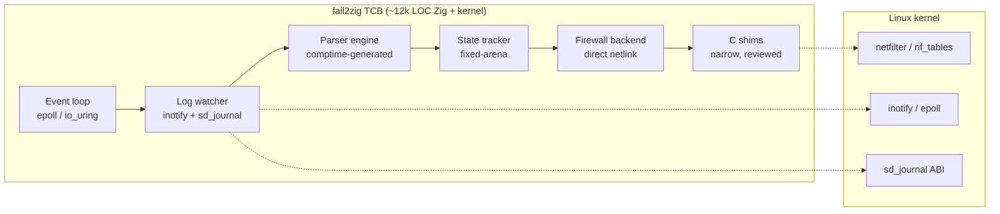

# Trusted computing base

The **trusted computing base (TCB)** of a program is the set of code that
must be correct for the program's security guarantees to hold. For a
root-privileged daemon, the TCB is everything running in that daemon's
address space — every library linked in, every interpreter loaded,
every runtime that decides what bytes become instructions. If any line
of code in the TCB is wrong, every security property the program claims
is suspect.

For fail2zig this is not an abstraction. The daemon holds
`CAP_NET_ADMIN` and `CAP_DAC_READ_SEARCH`, reads logs that an attacker
can influence, and writes kernel firewall state. Whatever is in the TCB
runs with that authority.

The design goal of this document is to make the TCB auditable in an
afternoon — by showing what is in it, what is not in it, and how to
verify both.

## What "in the TCB" means for fail2zig

A line of code is in the TCB if any of the following are true:

- It executes in the daemon process with the daemon's capabilities.
- It parses attacker-controlled input.
- It decides whether a ban fires, or writes firewall state.
- The integrity of the binary depends on it (build system, linker,
  toolchain).

Everything else — services being protected, scrapers reading the
metrics endpoint, clients calling `fail2zig-client` — is outside the
TCB. Those can be compromised without directly compromising fail2zig's
authority.

## The fail2zig TCB



Every box in the top group is code fail2zig ships. Everything it reaches
for lives in the kernel — the trust base any Linux program already
depends on.

| Component                                       | Lines of Zig (approx.) | Runs as root      |
| ----------------------------------------------- | ---------------------- | ----------------- |
| Event loop + watcher                            | 1,400                  | yes               |
| Parser engine + filters                         | 3,200                  | yes               |
| State tracker                                   | 1,100                  | yes               |
| Firewall backends (nftables / iptables / ipset) | 3,800                  | yes               |
| IPC server + client protocol                    | 900                    | yes               |
| Config parser (TOML + fail2ban import)          | 1,500                  | yes, startup only |
| C shims to kernel ABIs                          | 150                    | yes               |
| **Total**                                       | **~12,000**            |                   |

That is the entire TCB. No third-party Zig packages are pulled in. No
`libc` helpers are invoked in the parse or ban path — the binary links
against `musl` at build time for the release artifact and operates on
raw syscalls in the hot path. The C shims exist only where the kernel
ABI requires a syscall wrapper, and each one is short enough that the
contract with the kernel is legible at a glance.

## What is deliberately not in the TCB

| Excluded                                                      | Because                                                                         |
| ------------------------------------------------------------- | ------------------------------------------------------------------------------- |
| Python / Perl / Ruby / Node / Java runtime                    | No interpreter, no VM. The binary is the only thing that executes.              |
| Third-party netlink helpers (`libmnl`, `libnftnl`, `libnl-3`) | Hand-written TLV frame builders, audited against `linux/netfilter/nf_tables.h`. |
| `libcap` / `libcap-ng`                                        | `/proc/self/status` + `prctl` syscall read directly.                            |
| `libsystemd`                                                  | The sd_notify protocol subset we use is in-tree (~80 lines).                    |
| `libpcre` / regex engines                                     | Filters are compiled at build time by `comptime`; no runtime regex interpreter. |
| `/bin/sh`                                                     | Ban actions are pure function calls. The daemon never execs.                    |
| `nft`, `iptables`, `ipset` binaries                           | Firewall state is written via netlink directly, never via subprocess.           |
| External config preprocessors                                 | TOML parsing is in-tree. No Jinja, no M4, no shell substitution.                |

Each exclusion is a CVE-class removed from the attack surface. Shell
injection requires a shell. Python sandbox escape requires Python. A
supply-chain compromise of `libnftnl` requires linking `libnftnl`. The
cheapest way to be immune to a class of attack is to not participate in
the architecture it exploits.

## Compared to a typical Python host-IPS TCB

For reference, a representative Python-based IPS installation includes,
at minimum:

- The CPython interpreter (~400k LOC C)
- The Python standard library (~500k LOC Python + C)
- `python3-systemd`, `python3-pyinotify`, or equivalent (C extension
  modules)
- Any filter-language dependencies (`regex`, `netaddr`, etc.)
- `/bin/sh`, plus every CLI the action templates invoke (`iptables`,
  `ipset`, `ip`, `nft`, …) and each of their transitive library
  dependencies

The difference is not about Python being inferior software — CPython is
world-class. The difference is about what belongs in the TCB of a
daemon that runs as root. An interpreter that can load any bytecode,
parse any input, import any module, is by construction a much larger
contract to uphold than a static binary that does one thing and can
only do that thing.

## How to audit the TCB yourself

Because fail2zig publishes reproducible builds, you can recreate the
binary yourself and verify that what you audited is what runs:

```bash
# 1. Clone the source and build with the release toolchain.
git clone https://github.com/ul0gic/fail2zig
cd fail2zig
git checkout v0.1.0
zig build -Doptimize=.ReleaseSafe \
          -Dtarget=x86_64-linux-musl

# 2. Compare against the published release checksum.
sha256sum zig-out/bin/fail2zig
curl -s https://fail2zig.com/releases/0.1.0/SHA256SUMS | grep fail2zig

# 3. Confirm the runtime posture matches the TCB claim.
ldd zig-out/bin/fail2zig       # "statically linked"
strings zig-out/bin/fail2zig | grep -E 'python|perl|ruby'   # empty
```

Full verification recipe: [Verifying zero
dependencies](../guides/verifying-zero-dependencies).

## The TCB is a promise, not a state

Every release changes the TCB. The project's commitment is not that
the TCB is small today — it is that the TCB is **auditable**, and that
any addition to it is a deliberate decision with a defensible reason.
When a new Zig version is adopted, when a new kernel ABI is used, when
a new C shim is written, that change is documented in the
[changelog](/changelog) and the rationale is recorded in the
corresponding merge commit.

The goal is not minimalism as an aesthetic. The goal is that the
daemon running on your server is the daemon you can reason about
without trusting a supply chain you did not choose.

## Related reading

- [Zero runtime dependencies](zero-dependencies) — the architectural
  principle this document measures.
- [Netlink interop](netlink-interop) — the case study for why pure
  kernel-ABI interaction keeps shell programs out of the TCB.
- [Verifying zero dependencies](../guides/verifying-zero-dependencies) —
  operator-facing recipe for auditing the TCB on a live system.
- [Threat model](/threat-model) — what the TCB is defending against.
